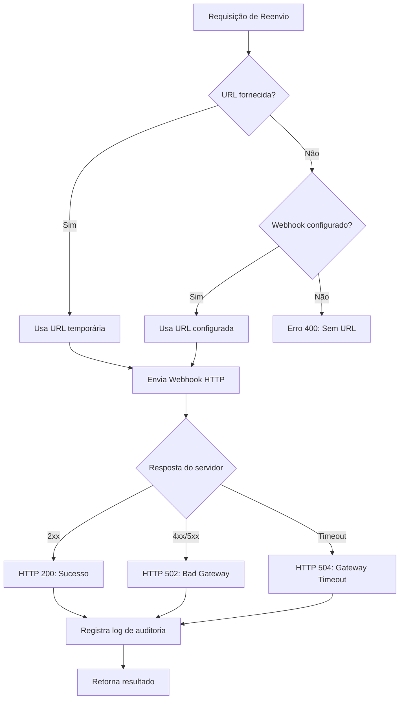

## Visão Geral

O endpoint de **Reenvio de Webhook** permite que você solicite o reenvio manual de notificações de transações específicas. Isso é útil em cenários onde:

- Seu servidor estava indisponível quando o webhook original foi enviado
- Você precisa reprocessar uma transação específica
- Deseja testar a integração com uma URL diferente temporariamente

<Info>
  Este endpoint não altera a configuração de webhook da sua conta. A URL fornecida é usada apenas para o reenvio específico.
</Info>

---

## Funcionamento

### Identificação da Transação

O endpoint aceita três tipos de identificadores:

| Tipo | Descrição | Escopo |
|------|-----------|--------|
| **ID Numérico** | ID interno da transação (campo `transactionId` nos webhooks) | Global |
| **ID Externo** | Identificador fornecido por você na criação (campo `externalId`) | Único por conta |
| **End-to-End ID** | Identificador PIX do BACEN (campo `endToEndId`, formato: E/D + 32 chars) | Único por transação |

<Note>
  O sistema busca simultaneamente por todos os tipos de identificador na sua conta. Na prática não há ambiguidade: id numérico é puramente dígitos; e2eId começa com 'E' ou 'D' seguido de 32 caracteres alfanuméricos; externalId é qualquer string fornecida por você.
</Note>

<Tip>
  **Qual identificador usar?** Use o `transactionId` numérico retornado pela Avista, o `externalId` que você forneceu na criação da transação, ou o `endToEndId` do PIX recebido nos webhooks. Todos são igualmente válidos.
</Tip>

### Processamento Síncrono

O reenvio de webhook é processado de forma **síncrona**. Isso significa que:

- A requisição aguarda o envio do webhook ser concluído
- O resultado é comunicado via HTTP status code (200, 502, 504)
- O tempo de resposta depende da latência do seu servidor (timeout: 10s)



<Info>
  Diferentemente dos webhooks automáticos (que utilizam filas com retry), o reenvio manual é executado imediatamente e retorna o resultado na mesma requisição.
</Info>

---

## Casos de Uso

### 1. Reenvio para URL Configurada

Se você já tem um webhook configurado na sua conta, basta chamar o endpoint sem body:

```bash
curl -X POST https://api.avista.global/api/resend-webhook/external-teste-001 \
  -H "Authorization: Bearer SEU_TOKEN" \
  -H "Content-Type: application/json"
```

### 2. Reenvio com URL Temporária

Para testar com uma URL diferente ou reenviar para um endpoint de contingência:

```bash
curl -X POST https://api.avista.global/api/resend-webhook/external-teste-001 \
  -H "Authorization: Bearer SEU_TOKEN" \
  -H "Content-Type: application/json" \
  -d '{
    "url": "https://meu-servidor-backup.com/webhooks/avista"
  }'
```

<Warning>
  A URL temporária **não é persistida**. O próximo webhook automático será enviado para a URL configurada na conta.
</Warning>

---

## Resposta

### Sucesso (200)

Webhook enviado com sucesso para a URL de destino.

```json
{
  "message": "Webhook resent successfully",
  "webhookLogId": 12345,
  "sentAt": "2024-01-15T10:30:00.000Z",
  "statusCode": 200
}
```

### Erro: Sem URL Configurada (400)

```json
{
  "statusCode": 400,
  "message": "No webhook configured and no override URL provided",
  "error": "Bad Request"
}
```

### Erro: Transação Não Encontrada (404)

```json
{
  "statusCode": 404,
  "message": "Transaction not found",
  "error": "Not Found"
}
```

### Erro: Destino Retornou Erro (502)

O servidor de destino retornou um erro (4xx ou 5xx) ou houve falha de conexão.

```json
{
  "statusCode": 502,
  "message": "Webhook failed with status 500",
  "webhookLogId": 12345,
  "sentAt": "2024-01-15T10:30:00.000Z"
}
```

<Warning>
  Mesmo em caso de erro, o webhook é registrado no log de auditoria. Use o `webhookLogId` para rastreamento.
</Warning>

### Erro: Timeout (504)

O servidor de destino não respondeu dentro do tempo limite (10 segundos).

```json
{
  "statusCode": 504,
  "message": "Timeout after 10000ms",
  "webhookLogId": 12345,
  "sentAt": "2024-01-15T10:30:00.000Z"
}
```

<Tip>
  Se você está recebendo timeouts frequentes, verifique se seu servidor está respondendo em menos de 10 segundos.
</Tip>

---

## Rate Limiting

<Warning>
  Este endpoint possui rate limiting de **60 requisições por minuto** por conta para evitar abusos.
</Warning>

Se o limite for excedido, você receberá um erro `429 Too Many Requests`:

```json
{
  "statusCode": 429,
  "message": "Too Many Requests"
}
```

---

## Auditoria

Todos os reenvios manuais são registrados para fins de auditoria e rastreabilidade:

| Informação | Descrição |
|------------|-----------|
| Tipo de envio | Marcado como reenvio manual |
| URL utilizada | Registra se foi usada URL temporária ou configurada |
| Resultado | Status HTTP e tempo de resposta |
| Identificador | ID único do log para rastreamento |

<Tip>
  Use o `webhookLogId` retornado na resposta para correlacionar com logs de suporte se necessário.
</Tip>

---

## Exemplos de Integração

<CodeGroup>

```javascript Node.js
const axios = require('axios');

async function resendWebhook(transactionId, overrideUrl = null) {
  const config = {
    headers: {
      'Authorization': `Bearer ${process.env.AVISTA_TOKEN}`,
      'Content-Type': 'application/json'
    }
  };

  const body = overrideUrl ? { url: overrideUrl } : {};

  try {
    const response = await axios.post(
      `https://api.avista.global/api/resend-webhook/${transactionId}`,
      body,
      config
    );

    console.log('Webhook reenviado:', response.data);
    return response.data;
  } catch (error) {
    console.error('Erro ao reenviar webhook:', error.response?.data);
    throw error;
  }
}

// Uso
resendWebhook('external-teste-001');
resendWebhook('external-teste-001', 'https://backup.meusite.com/webhook'); // Com URL temporária
```

```python Python
import requests
import os

def resend_webhook(transaction_id: str, override_url: str = None):
    headers = {
        'Authorization': f'Bearer {os.environ["AVISTA_TOKEN"]}',
        'Content-Type': 'application/json'
    }

    body = {'url': override_url} if override_url else {}

    response = requests.post(
        f'https://api.avista.global/api/resend-webhook/{transaction_id}',
        json=body,
        headers=headers
    )

    response.raise_for_status()
    return response.json()

# Uso
result = resend_webhook('external-teste-001')
print(f"Webhook reenviado: {result}")

# Com URL temporária
result = resend_webhook('external-teste-001', 'https://backup.meusite.com/webhook')
```

```csharp C#
using System.Net.Http;
using System.Text;
using System.Text.Json;

public class AvistaClient
{
    private readonly HttpClient _client;
    private readonly string _token;

    public AvistaClient(string token)
    {
        _client = new HttpClient();
        _token = token;
        _client.DefaultRequestHeaders.Add("Authorization", $"Bearer {_token}");
    }

    public async Task<ResendWebhookResponse> ResendWebhookAsync(
        string transactionId,
        string overrideUrl = null)
    {
        var url = $"https://api.avista.global/api/resend-webhook/{transactionId}";

        var body = overrideUrl != null
            ? JsonSerializer.Serialize(new { url = overrideUrl })
            : "{}";

        var content = new StringContent(body, Encoding.UTF8, "application/json");

        var response = await _client.PostAsync(url, content);
        response.EnsureSuccessStatusCode();

        var json = await response.Content.ReadAsStringAsync();
        return JsonSerializer.Deserialize<ResendWebhookResponse>(json);
    }
}
```

</CodeGroup>

---

## Próximos Passos

<CardGroup cols={2}>
  <Card title="Visão Geral de Webhooks" icon="webhook" href="/api-reference/guides/webhooks/overview">
    Entenda como os webhooks funcionam na Avista
  </Card>
  <Card title="Implementação" icon="code" href="/api-reference/guides/webhooks/implementation">
    Guia completo de implementação de webhooks
  </Card>
</CardGroup>
