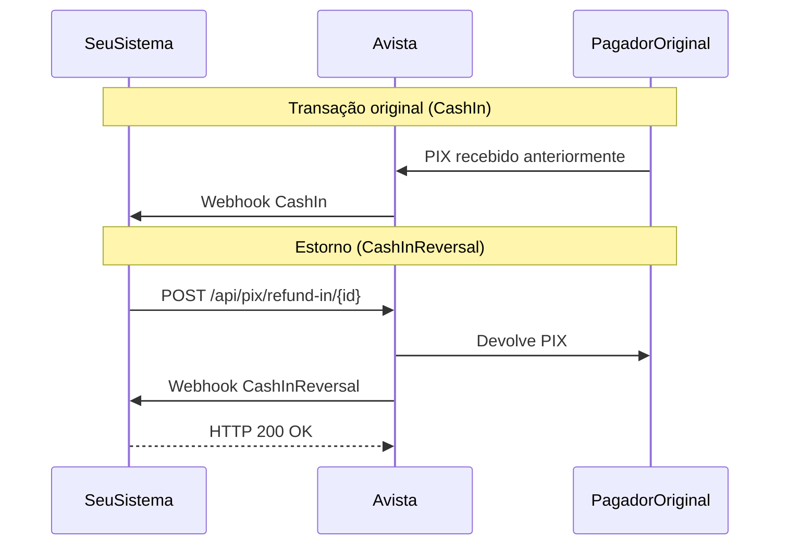

## Visão Geral

O evento **CashInReversal** é enviado quando você inicia um **estorno** de um PIX recebido anteriormente, devolvendo o valor ao pagador original. Este evento ocorre quando você chama a API de Refund-In.

<Info>
  O `movementType` para CashInReversal é `DEBIT`, pois você está devolvendo dinheiro que havia entrado na sua conta.
</Info>

| Campo | Valor |
|-------|-------|
| `event` | `CashInReversal` |
| `movementType` | `DEBIT` |
| Significado | Você devolveu dinheiro que havia recebido |

---

## Payload Completo

```json
{
  "event": "CashInReversal",
  "status": "CONFIRMED",
  "transactionType": "PIX",
  "movementType": "DEBIT",
  "transactionId": "11111",
  "externalId": "refund-678689ca-3e16-4f5e-a08f-09a984a97781",
  "endToEndId": "D07136847202512112011O5222ZRBI5A",
  "pixKey": null,
  "feeAmount": 0.01,
  "originalAmount": 0.3,
  "finalAmount": 0.31,
  "processingDate": "2025-12-11T20:11:13.289Z",
  "errorCode": null,
  "errorMessage": null,
  "metadata": {},
  "parentTransaction": {
    "transactionId": "12345",
    "externalId": "PIX-5482123298-EJUYFSMU1UU",
    "endToEndId": "E00416968202512111942rjzxxzSSTD9",
    "processingDate": "2025-12-11T19:42:04.080Z",
    "wasTotalRefunded": false,
    "remainingAmountForRefund": 0.2,
    "metadata": {},
    "counterpart": {
      "name": "Carlos Oliveira",
      "document": "*.345.678-**",
      "bank": {
        "bankISPB": null,
        "bankName": null,
        "bankCode": null,
        "accountBranch": null,
        "accountNumber": null
      }
    }
  }
}
```

---

## Campos Específicos do CashInReversal

O CashInReversal inclui o objeto `parentTransaction` com dados da transação original que está sendo estornada.

### parentTransaction

<ParamField path="parentTransaction" type="object" required>
  Dados da transação **PIX In original** que está sendo estornada.
</ParamField>

<ParamField path="parentTransaction.transactionId" type="string">
  ID numérico da transação PIX In original (retornado como string).
</ParamField>

<ParamField path="parentTransaction.externalId" type="string">
  ID externo da transação original.
</ParamField>

<ParamField path="parentTransaction.endToEndId" type="string">
  ID End-to-End da transação original.
</ParamField>

<ParamField path="parentTransaction.processingDate" type="string">
  Data de processamento da transação original.
</ParamField>

<ParamField path="parentTransaction.wasTotalRefunded" type="boolean">
  Indica se o valor total da transação original foi estornado.

  - `true`: Estorno total (não pode estornar mais)
  - `false`: Estorno parcial (ainda pode estornar o restante)
</ParamField>

<ParamField path="parentTransaction.remainingAmountForRefund" type="number">
  Valor restante que ainda pode ser estornado (em reais).

  **Exemplo:** `0.2` (ainda pode estornar R$ 0,20)
</ParamField>

<ParamField path="parentTransaction.counterpart" type="object">
  Dados do pagador original que receberá o estorno.
</ParamField>

---

## Estorno Total vs Parcial

### Estorno Total
Quando você devolve 100% do valor recebido:

```json
{
  "parentTransaction": {
    "wasTotalRefunded": true,
    "remainingAmountForRefund": 0
  }
}
```

### Estorno Parcial
Quando você devolve apenas parte do valor:

```json
{
  "parentTransaction": {
    "wasTotalRefunded": false,
    "remainingAmountForRefund": 0.2
  }
}
```

<Note>
  Você pode fazer múltiplos estornos parciais até que `wasTotalRefunded` seja `true`.
</Note>

---

## Casos de Uso

### 1. Devolução de Pagamento Duplicado
```javascript
async function handleCashInReversal(payload) {
  const refundId = payload.transactionId;
  const originalOrderId = payload.parentTransaction.externalId;

  await refundService.markAsCompleted({
    refundId,
    originalOrderId,
    amount: payload.originalAmount,
    completedAt: payload.processingDate
  });

  // Notificar cliente sobre a devolução
  await notificationService.sendRefundConfirmation({
    orderId: originalOrderId,
    amount: payload.originalAmount
  });
}
```

### 2. Controle de Estornos Parciais
```javascript
async function handleCashInReversal(payload) {
  const { parentTransaction } = payload;

  await refundService.updateStatus({
    originalTransactionId: parentTransaction.transactionId,
    totalRefunded: !parentTransaction.wasTotalRefunded
      ? false
      : true,
    remainingAmount: parentTransaction.remainingAmountForRefund
  });

  if (parentTransaction.wasTotalRefunded) {
    console.log('Transação totalmente estornada');
  } else {
    console.log(`Ainda disponível para estorno: R$ ${parentTransaction.remainingAmountForRefund}`);
  }
}
```

---

## Fluxo Típico



---

## Próximos Passos

<CardGroup cols={2}>
  <Card title="PIX Refund-In" icon="rotate-left" href="/api-reference/guides/pix-refund-in">
    Aprenda a estornar recebimentos
  </Card>
  <Card title="CashIn" icon="arrow-down" href="/api-reference/guides/webhooks/cash-in">
    Entenda o evento de recebimento
  </Card>
</CardGroup>
