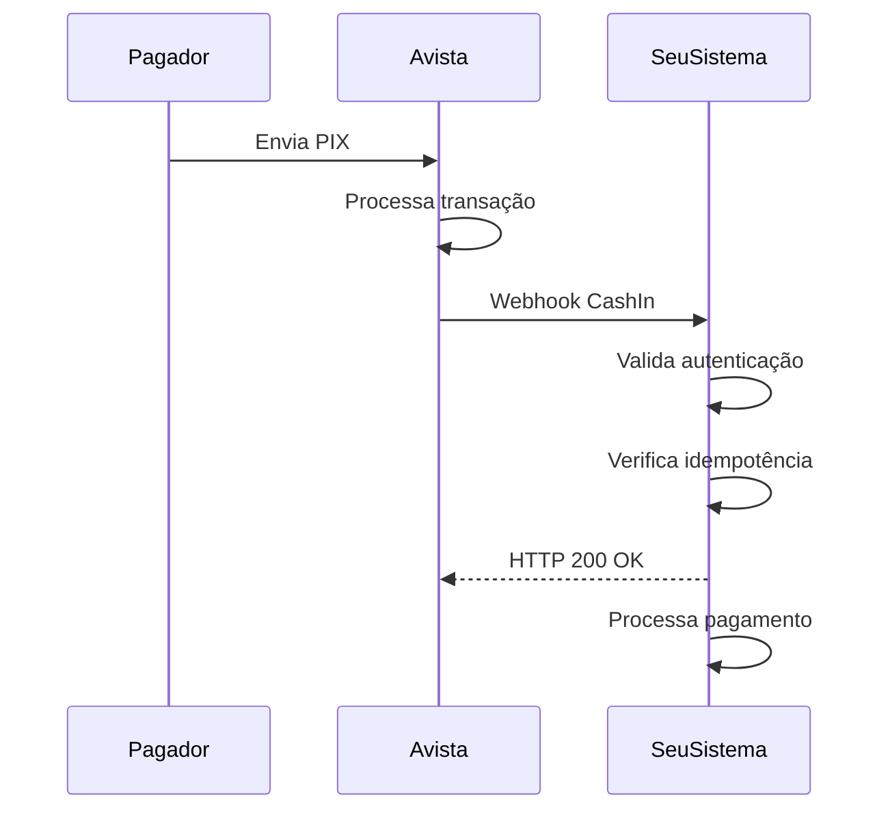

## Visão Geral

O evento **CashIn** é enviado quando um pagamento PIX é **recebido** com sucesso na sua conta. Este é o evento mais comum e indica que o dinheiro está disponível.

<Info>
  O `movementType` para CashIn é sempre `CREDIT`, indicando entrada de recursos na conta.
</Info>

| Campo | Valor |
|-------|-------|
| `event` | `CashIn` |
| `movementType` | `CREDIT` |
| Significado | Dinheiro entrou na sua conta |

---

## Payload Completo

```json
{
  "event": "CashIn",
  "status": "CONFIRMED",
  "transactionType": "PIX",
  "movementType": "CREDIT",
  "transactionId": "12345",
  "externalId": "PIX-5482123298-EJUYFSMU1UU",
  "endToEndId": "E00416968202512111942rjzxxzSSTD9",
  "pixKey": "1ff6ce09-4244-44d5-aa8f-1fe69f8986a9",
  "feeAmount": 0.01,
  "originalAmount": 0.5,
  "finalAmount": 0.49,
  "processingDate": "2025-12-11T19:42:04.080Z",
  "errorCode": null,
  "errorMessage": null,
  "counterpart": {
    "name": "Carlos Oliveira",
    "document": "*.345.678-**",
    "bank": {
      "bankISPB": null,
      "bankName": null,
      "bankCode": null,
      "accountBranch": null,
      "accountNumber": null
    }
  },
  "metadata": {}
}
```

---

## Campos Específicos do CashIn

O CashIn inclui o objeto `counterpart` com dados do **pagador** (quem enviou o PIX).

<ParamField path="counterpart" type="object" required>
  Dados do **pagador** (quem enviou o PIX para você).
</ParamField>

<ParamField path="counterpart.name" type="string">
  Nome completo do pagador conforme cadastrado no banco de origem.
</ParamField>

<ParamField path="counterpart.document" type="string">
  CPF/CNPJ do pagador (parcialmente mascarado por questões de privacidade).

  **Exemplo:** `"*.345.678-**"`
</ParamField>

<ParamField path="counterpart.bank" type="object">
  Dados bancários do pagador.
</ParamField>

<ParamField path="counterpart.bank.bankISPB" type="string">
  Código ISPB do banco do pagador (identificador único no Sistema de Pagamentos Brasileiro).
</ParamField>

<ParamField path="counterpart.bank.bankName" type="string">
  Nome do banco do pagador.
</ParamField>

<ParamField path="counterpart.bank.bankCode" type="string">
  Código COMPE do banco (ex: "001" para Banco do Brasil, "260" para Nubank).
</ParamField>

<ParamField path="counterpart.bank.accountBranch" type="string">
  Agência do pagador (quando disponível).
</ParamField>

<ParamField path="counterpart.bank.accountNumber" type="string">
  Número da conta do pagador (quando disponível).
</ParamField>

---

## Cálculo do Valor Final

Para eventos de `CREDIT` (entrada), o valor final é calculado como:

```
finalAmount = originalAmount - feeAmount
```

<Note>
  A taxa (`feeAmount`) é descontada do valor original. Se o pagador enviou R$ 100,00 e a taxa é R$ 0,50, você receberá R$ 99,50.
</Note>

---

## Casos de Uso

### 1. Pagamento de Pedido
```javascript
async function handleCashIn(payload) {
  // Usar externalId para correlacionar com o pedido
  const orderId = payload.externalId.replace('PIX-', '');

  await orderService.markAsPaid({
    orderId,
    transactionId: payload.transactionId,
    amount: payload.finalAmount,
    paidAt: payload.processingDate
  });

  // Notificar cliente
  await notificationService.sendPaymentConfirmation(orderId);
}
```

### 2. Recarga de Saldo
```javascript
async function handleCashIn(payload) {
  await walletService.credit({
    userId: payload.metadata.userId,
    amount: payload.finalAmount,
    reference: payload.transactionId
  });
}
```

---

## Fluxo Típico



---

## Próximos Passos

<CardGroup cols={2}>
  <Card title="PIX Cash-In" icon="arrow-down" href="/api-reference/guides/pix-cash-in">
    Aprenda a gerar cobranças PIX
  </Card>
  <Card title="Estornar Pagamento" icon="rotate-left" href="/api-reference/guides/webhooks/cash-in-reversal">
    Entenda o evento de estorno
  </Card>
</CardGroup>
