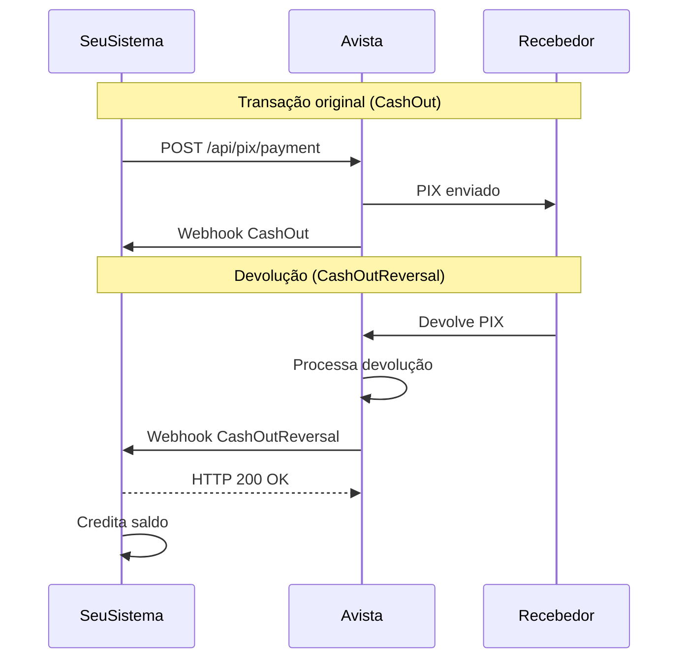

## Visão Geral

O evento **CashOutReversal** é enviado quando você **recebe uma devolução** de um PIX que enviou anteriormente. Isso pode ocorrer quando:

- O recebedor devolve o valor voluntariamente
- Há um problema com a transação original (dados inválidos, conta encerrada, etc.)
- O banco destino rejeita a transação

<Info>
  O `movementType` para CashOutReversal é `CREDIT`, pois você está recebendo de volta dinheiro que havia saído da sua conta.
</Info>

| Campo | Valor |
|-------|-------|
| `event` | `CashOutReversal` |
| `movementType` | `CREDIT` |
| Significado | Você recebeu de volta dinheiro que havia enviado |

---

## Payload Completo

```json
{
  "event": "CashOutReversal",
  "status": "CONFIRMED",
  "transactionType": "PIX",
  "movementType": "CREDIT",
  "transactionId": "22222",
  "externalId": null,
  "endToEndId": "D18236120202512112009s0018351d9f",
  "pixKey": "07646173380",
  "feeAmount": 0.01,
  "originalAmount": 0.08,
  "finalAmount": 0.07,
  "processingDate": "2025-12-11T20:09:27.786Z",
  "errorCode": null,
  "errorMessage": null,
  "metadata": {
    "refund": {
      "value": 8,
      "originalValue": 31000,
      "referenceTransactionId": 917561
    },
    "provider": "hyperwallet",
    "counterpart": {
      "bankCode": "260",
      "bankIspb": "18236120",
      "bankName": "NU PAGAMENTOS S.A. - INSTITUIÇÃO DE PAGAMENTO"
    },
    "webhookEvent": "PixOutReversalExternal",
    "originatedFrom": "WEBHOOK_DIRECT"
  },
  "parentTransaction": {
    "transactionId": "67890",
    "externalId": "PIX-OUT-5483571657-OWUJDUDVDO",
    "endToEndId": "E071368472025121120065P1T3N1CS1A",
    "processingDate": "2025-12-11T20:06:12.117Z",
    "wasTotalRefunded": false,
    "remainingAmountForRefund": 0.22,
    "metadata": {},
    "counterpart": {
      "name": "Ana Costa",
      "document": "*.765.432-**",
      "bank": {
        "bankISPB": null,
        "bankName": null,
        "bankCode": "260",
        "accountBranch": null,
        "accountNumber": null
      }
    }
  }
}
```

---

## Campos Específicos do CashOutReversal

O CashOutReversal inclui campos adicionais no `metadata` e o objeto `parentTransaction`.

### metadata.refund

<ParamField path="metadata.refund" type="object">
  Detalhes da devolução recebida.
</ParamField>

<ParamField path="metadata.refund.value" type="number">
  Valor devolvido **em centavos**.

  **Exemplo:** `8` (R$ 0,08)
</ParamField>

<ParamField path="metadata.refund.originalValue" type="number">
  Valor original da transação **em centavos**.

  **Exemplo:** `31000` (R$ 310,00)
</ParamField>

<ParamField path="metadata.refund.referenceTransactionId" type="number">
  ID interno de referência da transação original no provedor.
</ParamField>

### parentTransaction

<ParamField path="parentTransaction" type="object" required>
  Dados da transação **PIX Out original** que foi devolvida.
</ParamField>

<ParamField path="parentTransaction.transactionId" type="string">
  ID numérico da transação PIX Out original (retornado como string).
</ParamField>

<ParamField path="parentTransaction.externalId" type="string">
  ID externo que você forneceu ao criar o PIX Out.
</ParamField>

<ParamField path="parentTransaction.wasTotalRefunded" type="boolean">
  Indica se o valor total foi devolvido.

  - `true`: Devolução total
  - `false`: Devolução parcial
</ParamField>

<ParamField path="parentTransaction.remainingAmountForRefund" type="number">
  Valor restante que ainda pode ser devolvido (em reais).
</ParamField>

<ParamField path="parentTransaction.counterpart" type="object">
  Dados do recebedor original que devolveu o PIX.
</ParamField>

---

## Diferença: CashInReversal vs CashOutReversal

| Aspecto | CashInReversal | CashOutReversal |
|---------|----------------|-----------------|
| **Quem inicia** | Você (via API Refund-In) | O recebedor ou o banco destino |
| **Direção** | Você → Pagador original | Recebedor → Você |
| **movementType** | `DEBIT` (saída) | `CREDIT` (entrada) |
| **Quando ocorre** | Você decide devolver | Você recebe de volta |

---

## Casos de Uso

### 1. Devolução Recebida
```javascript
async function handleCashOutReversal(payload) {
  const { parentTransaction, metadata } = payload;

  // Creditar o valor devolvido no saldo
  await balanceService.credit({
    amount: payload.finalAmount,
    reference: payload.transactionId,
    originalPaymentId: parentTransaction.transactionId
  });

  // Atualizar status do pagamento original
  await paymentService.markAsRefunded({
    paymentId: parentTransaction.externalId,
    refundAmount: payload.originalAmount,
    wasFullRefund: parentTransaction.wasTotalRefunded
  });

  // Notificar equipe financeira
  await notificationService.sendRefundReceived({
    originalAmount: metadata.refund.originalValue / 100,
    refundAmount: metadata.refund.value / 100
  });
}
```

### 2. Tratamento de Rejeição
```javascript
async function handleCashOutReversal(payload) {
  // Se o PIX foi devolvido, pode ser rejeição do banco
  if (payload.metadata.originatedFrom === 'WEBHOOK_DIRECT') {
    console.log('PIX rejeitado pelo banco destino');

    await transferService.markAsFailed({
      transferId: payload.parentTransaction.externalId,
      reason: 'Devolvido pelo banco destino'
    });

    // Notificar usuário para verificar dados
    await notificationService.sendTransferFailed();
  }
}
```

---

## Fluxo Típico



---

## Próximos Passos

<CardGroup cols={2}>
  <Card title="PIX Cash-Out" icon="arrow-up" href="/api-reference/guides/pix-cash-out">
    Aprenda a enviar pagamentos PIX
  </Card>
  <Card title="CashOut" icon="arrow-up" href="/api-reference/guides/webhooks/cash-out">
    Entenda o evento de envio
  </Card>
</CardGroup>
