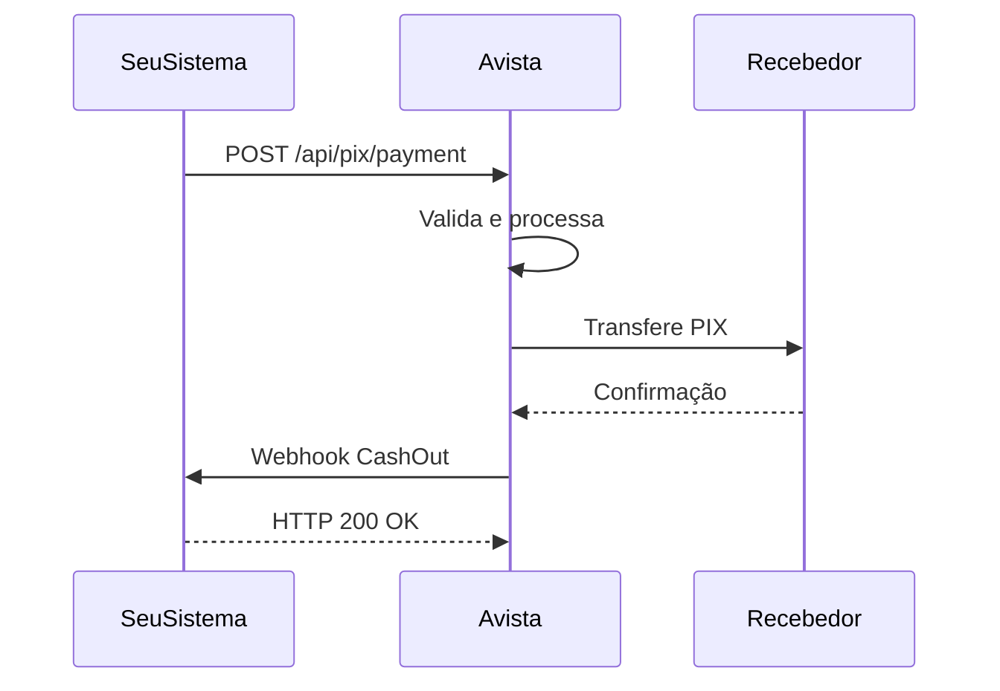

## Visão Geral

O evento **CashOut** é enviado quando um pagamento PIX é **enviado** com sucesso da sua conta para outra conta. Indica que a transferência foi completada.

<Info>
  Este evento é disparado tanto para pagamentos via chave PIX (`/api/pix/cash-out`) quanto para pagamentos via QR Code (`/api/pix/cash-out-qrcode`).
</Info>

<Info>
  O `movementType` para CashOut é sempre `DEBIT`, indicando saída de recursos da conta.
</Info>

| Campo | Valor |
|-------|-------|
| `event` | `CashOut` |
| `movementType` | `DEBIT` |
| Significado | Dinheiro saiu da sua conta |

---

## Payload Completo

```json
{
  "event": "CashOut",
  "status": "CONFIRMED",
  "transactionType": "PIX",
  "movementType": "DEBIT",
  "transactionId": "67890",
  "externalId": "PIX-OUT-5483571657-OWUJDUDVDO",
  "endToEndId": "E071368472025121120065P1T3N1CS1A",
  "pixKey": "07646173380",
  "feeAmount": 0.01,
  "originalAmount": 0.30,
  "finalAmount": 0.31,
  "processingDate": "2025-12-11T20:06:12.117Z",
  "errorCode": null,
  "errorMessage": null,
  "counterpart": {
    "name": "Ana Costa",
    "document": "*.765.432-**",
    "bank": {
      "bankISPB": null,
      "bankName": null,
      "bankCode": "260",
      "accountBranch": null,
      "accountNumber": null
    }
  },
  "metadata": {}
}
```

---

## Campos Específicos do CashOut

O CashOut inclui o objeto `counterpart` com dados do **recebedor** (quem recebeu o PIX).

<ParamField path="counterpart" type="object" required>
  Dados do **recebedor** (quem recebeu o PIX que você enviou).
</ParamField>

<ParamField path="counterpart.name" type="string">
  Nome completo do recebedor conforme cadastrado no banco de destino.
</ParamField>

<ParamField path="counterpart.document" type="string">
  CPF/CNPJ do recebedor (parcialmente mascarado por questões de privacidade).

  **Exemplo:** `"*.765.432-**"`
</ParamField>

<ParamField path="counterpart.bank" type="object">
  Dados bancários do recebedor.
</ParamField>

<ParamField path="counterpart.bank.bankCode" type="string">
  Código COMPE do banco do recebedor.

  **Exemplo:** `"260"` (Nubank)
</ParamField>

<ParamField path="counterpart.bank.bankISPB" type="string">
  Código ISPB do banco do recebedor.
</ParamField>

<ParamField path="counterpart.bank.bankName" type="string">
  Nome do banco do recebedor.
</ParamField>

---

## Cálculo do Valor Final

Para eventos de `DEBIT` (saída), o valor final é calculado como:

```
finalAmount = originalAmount + feeAmount
```

<Note>
  A taxa (`feeAmount`) é somada ao valor original. Se você enviou R$ 100,00 e a taxa é R$ 0,50, o débito total na sua conta será R$ 100,50.
</Note>

---

## Casos de Uso

### 1. Pagamento a Fornecedor
```javascript
async function handleCashOut(payload) {
  const paymentId = payload.externalId.replace('PIX-OUT-', '');

  await paymentService.markAsCompleted({
    paymentId,
    transactionId: payload.transactionId,
    endToEndId: payload.endToEndId,
    completedAt: payload.processingDate
  });

  // Notificar equipe financeira
  await notificationService.sendPaymentCompleted(paymentId);
}
```

### 2. Saque de Cliente
```javascript
async function handleCashOut(payload) {
  await withdrawalService.confirm({
    withdrawalId: payload.externalId,
    transactionId: payload.transactionId,
    amount: payload.originalAmount,
    fee: payload.feeAmount
  });
}
```

---

## Fluxo Típico



---

## Tratamento de Erros

Quando um CashOut falha, você receberá o webhook com `status: "ERROR"`:

```json
{
  "event": "CashOut",
  "status": "ERROR",
  "errorCode": "INVALID_PIX_KEY",
  "errorMessage": "Chave PIX não encontrada ou inválida",
  ...
}
```

<Warning>
  Quando `status` é `ERROR`, o valor **não foi debitado** da sua conta. Trate o erro e informe o usuário.
</Warning>

---

## Próximos Passos

<CardGroup cols={2}>
  <Card title="PIX Cash-Out" icon="arrow-up" href="/api-reference/guides/pix-cash-out">
    Aprenda a enviar pagamentos PIX
  </Card>
  <Card title="Cash-Out via QR Code" icon="qrcode" href="/api-reference/guides/pix-cash-out-qrcode">
    Pague via QR Code PIX
  </Card>
  <Card title="Devolução Recebida" icon="rotate" href="/api-reference/guides/webhooks/cash-out-reversal">
    Entenda o evento de devolução
  </Card>
</CardGroup>
