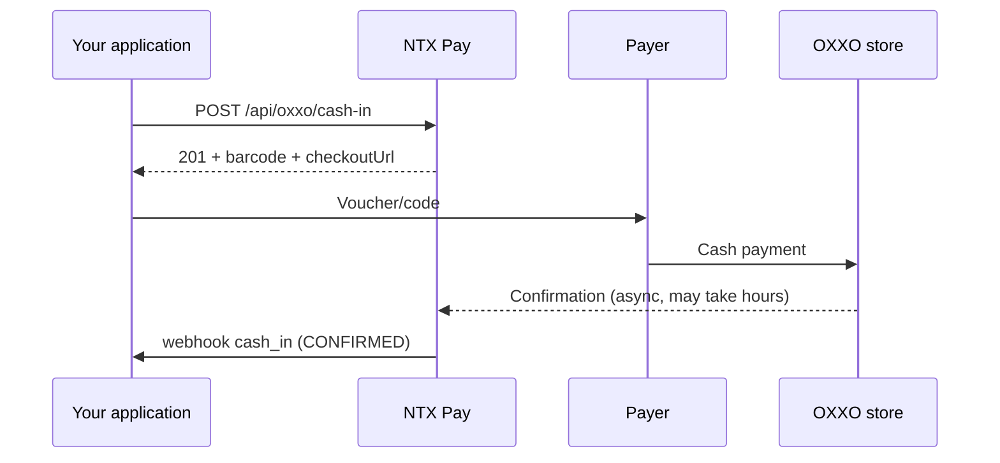

## Overview

**OXXO cash-in** generates a **barcode / voucher** that the payer prints or shows on their phone and takes to any **OXXO** store in México to pay in cash. After scanning at the register, NTX Pay receives confirmation and triggers the `cash_in` webhook.

Characteristics:

- **Offline** payment (physical OXXO store)
- **Delayed** confirmation — can take minutes to a few hours after payment
- Expires on configurable date (default ~7 days)

## Endpoint

### POST /api/oxxo/cash-in

#### Headers

```
Authorization: Bearer {token}
Content-Type: application/json
```

#### Request

```bash
curl -X POST https://api.ntxpay.com/api/oxxo/cash-in \
  -H "Authorization: Bearer $TOKEN" \
  -H "Content-Type: application/json" \
  -d '{
    "amountCentavos": 20000,
    "customerName": "Juan Perez",
    "customerTaxId": "PEPJ800101ABC",
    "externalId": "order-xyz-789"
  }'
```

#### Response (201)

```json
{
  "id": 33333,
  "status": "PENDING",
  "barcode": "012345678901234567",
  "referenceNumerical": "12345-67890",
  "checkoutUrl": "https://pay.ntxpay.com/oxxo/abc",
  "expiresAt": "2026-05-20T23:59:59.000Z",
  "amountCentavos": 20000
}
```

## Request Fields

<ParamField path="amountCentavos" type="integer" required>
  Value in MXN centavos (minimum 1). Ex.: `20000` = $200.00 MXN.
</ParamField>

<ParamField path="customerName" type="string" required>
  Payer name (3–255 characters). Appears on the voucher.
</ParamField>

<ParamField path="customerTaxId" type="string">
  Payer RFC/CURP (10–20 characters).
</ParamField>

<ParamField path="externalId" type="string">
  External identifier (up to 100 characters). Recommended for idempotency.
</ParamField>

## What to show the payer

The response includes three representations of the same charge:

- **`barcode`** — barcode as string. Generate the image using a local lib (`bwip-js`, `python-barcode`, etc.).
- **`referenceNumerical`** — human-readable reference number for register entry.
- **`checkoutUrl`** — public URL with printable voucher ready.

Recommendation: show the `checkoutUrl` (visual ready) or generate the `barcode` image in your app.

## Flow



## States

| Status | Meaning |
|---|---|
| `PENDING` | Charge issued, waiting for OXXO payment |
| `CONFIRMED` | Payment received and confirmed |
| `EXPIRED` | Charge expired unpaid |

## Considerations

<Warning>
  OXXO confirmation is **not real-time**. Don't show the product as "paid" before the `cash_in` webhook. For experiences that require immediate confirmation, prefer SPEI cash-in.
</Warning>

- The `barcode` is unique per charge and cannot be reused
- OXXO has a maximum limit of ~$10,000 MXN per transaction (varies by store)
- Partial payments not allowed — payer pays the exact voucher amount

## Next Steps

<CardGroup cols={2}>
  <Card title="cash_in webhook" href="/en/guides/webhooks/cash-in">
    Receive async payment confirmation
  </Card>
  <Card title="SPEI Cash-In" href="/en/guides/spei-cash-in">
    For immediate confirmation, use SPEI
  </Card>
</CardGroup>
