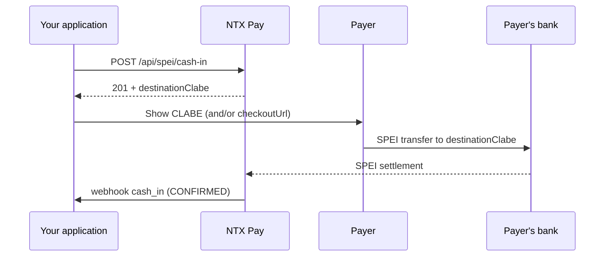

## Overview

**SPEI cash-in** generates a **disposable CLABE** that the payer uses to make a SPEI transfer from their banking app. When NTX Pay receives the settlement, the transaction moves to `CONFIRMED` and triggers the `cash_in` webhook.

Characteristics:

- CLABE valid for a **single** transfer (one-time use)
- **Asynchronous** confirmation (seconds to minutes)
- Expires on configurable date (default ~24 hours)

## Endpoint

### POST /api/spei/cash-in

#### Headers

```
Authorization: Bearer {token}
Content-Type: application/json
```

#### Request

```bash
curl -X POST https://sandbox.mx.ntxpay.com/api/spei/cash-in \
  -H "Authorization: Bearer $TOKEN" \
  -H "Content-Type: application/json" \
  -d '{
    "amountCentavos": 50000,
    "externalId": "order-abc-123",
    "description": "Order #123",
    "customerName": "Juan Perez",
    "customerEmail": "juan@example.com",
    "customerTaxId": "PEPJ800101ABC"
  }'
```

#### Response (201)

```json
{
  "id": 12345,
  "status": "PENDING",
  "destinationClabe": "012180001234567890",
  "beneficiary": {
    "name": "NTX Pay MX",
    "taxId": "NTX800101ABC"
  },
  "referenceNumerical": "1234567",
  "checkoutUrl": "https://pay.ntxpay.com/checkout/xyz",
  "expiresAt": "2026-05-14T23:59:59.000Z",
  "amountCentavos": 50000
}
```

## Request Fields

<ParamField path="amountCentavos" type="integer" required>
  Value in MXN centavos (minimum 1). Ex.: `50000` = $500.00 MXN.
</ParamField>

<ParamField path="externalId" type="string">
  Unique external identifier (up to 100 characters). Use to correlate with your system. Recommended for idempotency.
</ParamField>

<ParamField path="description" type="string">
  Charge description (up to 255 characters).
</ParamField>

<ParamField path="customerName" type="string" required>
  Payer name (1–255 characters), shown on the SPEI checkout.
</ParamField>

<ParamField path="customerEmail" type="string" required>
  Payer email (valid email format).
</ParamField>

<ParamField path="customerTaxId" type="string">
  Payer RFC/CURP (10–20 characters).
</ParamField>

## Payment Flow



## Transaction States

| Status | Meaning |
|---|---|
| `PENDING` | CLABE issued, waiting for transfer |
| `CONFIRMED` | Transfer received and settled |
| `FAILED` | Processing error |
| `EXPIRED` | CLABE expired without receiving transfer |

## Idempotency

Resend the same request with the same `externalId` to ensure that a network failure doesn't generate two charges. In case of duplication, NTX Pay returns the existing charge.

## Next Steps

<CardGroup cols={2}>
  <Card title="cash_in webhook" href="/en/guides/webhooks/cash-in">
    Details of the confirmation webhook payload
  </Card>
  <Card title="SPEI Cash-Out" href="/en/guides/spei-cash-out">
    Send SPEI transfers
  </Card>
</CardGroup>
