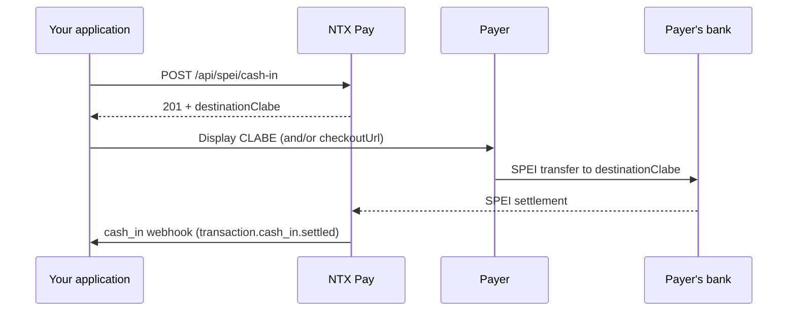

## Overview

**SPEI cash-in** generates a **disposable CLABE** that the payer uses to make a SPEI transfer from their banking app. When NTX Pay receives the settlement, you are notified on the `cash_in` webhook with the `transaction.cash_in.settled` event.

Characteristics:

- CLABE valid for a **single** transfer (one-time use)
- **Asynchronous** confirmation (seconds to minutes)
- Expires in ~24 hours if unpaid (you receive the `transaction.cash_in.expired` webhook)

## Endpoint

### POST /api/spei/cash-in

#### Headers

```
Authorization: Bearer {token}
Content-Type: application/json
```

#### Request

```bash
curl -X POST https://sandbox.mx.ntxpay.com/api/spei/cash-in \
  -H "Authorization: Bearer $TOKEN" \
  -H "Content-Type: application/json" \
  -d '{
    "amountCentavos": 50000,
    "externalId": "order-abc-123",
    "description": "Order #123",
    "customerName": "Juan Perez",
    "customerEmail": "juan@example.com",
    "customerTaxId": "PEPJ800101ABC"
  }'
```

#### Response (201)

```json
{
  "transactionId": "3f2a1c34-9d1e-4c7b-8a5e-2b6f0d9c4e71",
  "status": "PENDING",
  "destinationClabe": "012180001234567890",
  "beneficiary": {
    "name": "NTX Pay MX",
    "taxId": "NTX800101ABC"
  },
  "referenceNumerical": "1234567",
  "checkoutUrl": "https://pay.ntxpay.com/checkout/xyz",
  "expiresAt": "2026-05-14T23:59:59.000Z",
  "amountCentavos": 50000
}
```

Display the `destinationClabe` (and/or the `checkoutUrl`) to the end payer.

The `transactionId` (UUID) is the unique transaction identifier — it is the same value delivered in webhooks; use it to correlate events and look up the transaction.

## Response Fields

<ResponseField name="transactionId" type="string" required>
  Unique transaction identifier (UUID). Same value delivered in webhooks.
</ResponseField>

<ResponseField name="status" type="string" required>
  Transaction status: `PENDING`, `CONFIRMED`, `FAILED` or `EXPIRED`.
</ResponseField>

<ResponseField name="destinationClabe" type="string" required>
  Destination CLABE the payer must use for the SPEI transfer.
</ResponseField>

<ResponseField name="beneficiary" type="object" required>
  Beneficiary shown to the payer (`name` and, when available, `taxId`).
</ResponseField>

<ResponseField name="referenceNumerical" type="string">
  SPEI numeric reference, when available.
</ResponseField>

<ResponseField name="checkoutUrl" type="string">
  Hosted checkout URL (alternative to a manual transfer), when available.
</ResponseField>

<ResponseField name="expiresAt" type="string" required>
  Charge expiration (ISO 8601).
</ResponseField>

<ResponseField name="amountCentavos" type="integer" required>
  Amount in MXN centavos.
</ResponseField>

## Request Fields

<ParamField path="amountCentavos" type="integer" required>
  Amount in MXN centavos. **Minimum: `1000` centavos ($10.00 MXN)** — partner bank floor; below that the API returns `400` with code `CASHIN_MIN_AMOUNT`. E.g. `50000` = $500.00 MXN.
</ParamField>

<ParamField path="externalId" type="string">
  Unique external identifier (up to 100 characters). Use it to correlate with your system. Recommended for idempotency.
</ParamField>

<ParamField path="description" type="string">
  Charge description (up to 255 characters).
</ParamField>

<ParamField path="customerName" type="string" required>
  Payer name (1–255 characters), displayed on the SPEI checkout.
</ParamField>

<ParamField path="customerEmail" type="string" required>
  Payer email (valid email format).
</ParamField>

<ParamField path="customerTaxId" type="string">
  Payer RFC/CURP (10–20 characters).
</ParamField>

## Payment Flow


```mermaid
sequenceDiagram
    participant App as Your application
    participant NTX as NTX Pay
    participant Payer as Payer
    participant Bank as Payer's bank

    App->>NTX: POST /api/spei/cash-in
    NTX-->>App: 201 + destinationClabe
    App->>Payer: Display CLABE (and/or checkoutUrl)
    Payer->>Bank: SPEI transfer to destinationClabe
    Bank-->>NTX: SPEI settlement
    NTX->>App: cash_in webhook (transaction.cash_in.settled)
```

## Transaction States

| Status | Meaning |
|---|---|
| `PENDING` | CLABE issued, waiting for the transfer |
| `CONFIRMED` | Transfer received and settled |
| `FAILED` | Processing error |
| `EXPIRED` | CLABE expired without receiving a transfer |

On the webhook, the settlement arrives as `transaction.cash_in.settled` with `status: LIQUIDATED` — see the [full payload](/en/guides/webhooks/cash-in).

## Idempotency

Resend the same request with the same `externalId` to guarantee a network failure does not create two charges. On duplication, NTX Pay returns the existing charge.

## Testing in the Sandbox

In the sandbox, settlement is simulated within seconds — no issuing bank required. Control the outcome with the `X-Sandbox-Scenario` header:

```bash
curl -X POST https://sandbox.mx.ntxpay.com/api/spei/cash-in \
  -H "Authorization: Bearer $TOKEN" \
  -H "X-Sandbox-Scenario: rejected" \
  ...
```

See the [scenario catalog](/en/sandbox/scenarios) to force rejection, return, and delay.

## Next Steps

<CardGroup cols={2}>
  <Card title="cash_in Webhook" href="/en/guides/webhooks/cash-in">
    Confirmation webhook payload
  </Card>
  <Card title="SPEI Cash-Out" href="/en/guides/spei-cash-out">
    Send SPEI transfers
  </Card>
</CardGroup>
