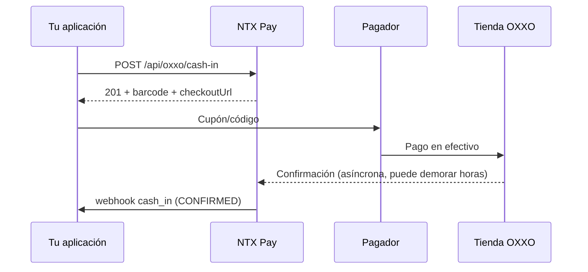

## Visión General

El **OXXO cash-in** genera un **código de barras / cupón** que el pagador imprime o muestra en el celular y lleva a cualquier tienda de la red **OXXO** en México para pagar en efectivo. Tras la lectura en caja, NTX Pay recibe la confirmación y dispara el webhook `cash_in`.

Características:

- Pago **off-line** (tienda física OXXO)
- Confirmación **tardía** — puede tomar minutos a algunas horas tras el pago
- Expira en fecha configurable (default ~7 días)

## Endpoint

### POST /api/oxxo/cash-in

#### Headers

```
Authorization: Bearer {token}
Content-Type: application/json
```

#### Request

```bash
curl -X POST https://api.ntxpay.com/api/oxxo/cash-in \
  -H "Authorization: Bearer $TOKEN" \
  -H "Content-Type: application/json" \
  -d '{
    "amountCentavos": 20000,
    "customerName": "Juan Perez",
    "customerTaxId": "PEPJ800101ABC",
    "externalId": "order-xyz-789"
  }'
```

#### Response (201)

```json
{
  "id": 33333,
  "status": "PENDING",
  "barcode": "012345678901234567",
  "referenceNumerical": "12345-67890",
  "checkoutUrl": "https://pay.ntxpay.com/oxxo/abc",
  "expiresAt": "2026-05-20T23:59:59.000Z",
  "amountCentavos": 20000
}
```

## Campos del Request

<ParamField path="amountCentavos" type="integer" required>
  Valor en centavos MXN (mínimo 1). Ej.: `20000` = $200.00 MXN.
</ParamField>

<ParamField path="customerName" type="string" required>
  Nombre del pagador (3–255 caracteres). Aparece en el cupón.
</ParamField>

<ParamField path="customerTaxId" type="string">
  RFC/CURP del pagador (10–20 caracteres).
</ParamField>

<ParamField path="externalId" type="string">
  Identificador externo (hasta 100 caracteres). Recomendado para idempotencia.
</ParamField>

## Qué mostrar al pagador

La respuesta trae tres representaciones del mismo cobro:

- **`barcode`** — código de barras en string. Genera la imagen usando una lib local (`bwip-js`, `python-barcode`, etc.).
- **`referenceNumerical`** — número de referencia legible para teclear en caja.
- **`checkoutUrl`** — URL pública con cupón imprimible listo.

Recomendación: muestra el `checkoutUrl` (visual ya listo) o genera la imagen del `barcode` en tu app.

## Flujo



## Estados

| Status | Significado |
|---|---|
| `PENDING` | Cobro emitido, esperando pago en OXXO |
| `CONFIRMED` | Pago recibido y confirmado |
| `EXPIRED` | Cobro expiró sin ser pagado |

## Consideraciones

<Warning>
  La confirmación OXXO **no es en tiempo real**. No muestres el producto como "pagado" antes del webhook `cash_in`. Para experiencias que requieren confirmación inmediata, prefiere SPEI cash-in.
</Warning>

- El `barcode` es único por cobro y no puede reutilizarse
- OXXO tiene límite máximo de ~$10 000 MXN por transacción (varía por tienda)
- No se puede pagar parcial — el pagador paga el monto exacto del cupón

## Próximos Pasos

<CardGroup cols={2}>
  <Card title="Webhook cash_in" href="/es/guides/webhooks/cash-in">
    Recibe confirmación asíncrona del pago
  </Card>
  <Card title="SPEI Cash-In" href="/es/guides/spei-cash-in">
    Para confirmación inmediata, usa SPEI
  </Card>
</CardGroup>
