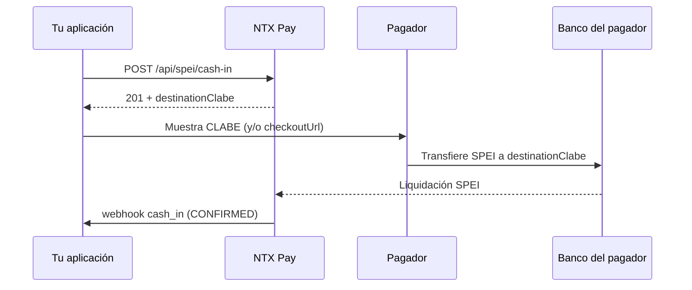

## Visión General

El **SPEI cash-in** genera una **CLABE desechable** que el pagador usa para realizar una transferencia SPEI desde su app bancaria. Cuando NTX Pay recibe la liquidación, la transacción pasa a `CONFIRMED` y dispara el webhook `cash_in`.

Características:

- CLABE válida para **una sola** transferencia (one-time use)
- Confirmación **asíncrona** (segundos a minutos)
- Expira en fecha configurable (default ~24 horas)

## Endpoint

### POST /api/spei/cash-in

#### Headers

```
Authorization: Bearer {token}
Content-Type: application/json
```

#### Request

```bash
curl -X POST https://api.ntxpay.com/api/spei/cash-in \
  -H "Authorization: Bearer $TOKEN" \
  -H "Content-Type: application/json" \
  -d '{
    "amountCentavos": 50000,
    "externalId": "order-abc-123",
    "description": "Pedido #123",
    "customerName": "Juan Perez",
    "customerEmail": "juan@example.com",
    "customerTaxId": "PEPJ800101ABC"
  }'
```

#### Response (201)

```json
{
  "id": 12345,
  "status": "PENDING",
  "destinationClabe": "012180001234567890",
  "beneficiary": {
    "name": "NTX Pay MX",
    "taxId": "NTX800101ABC"
  },
  "referenceNumerical": "1234567",
  "checkoutUrl": "https://pay.ntxpay.com/checkout/xyz",
  "expiresAt": "2026-05-14T23:59:59.000Z",
  "amountCentavos": 50000
}
```

## Campos del Request

<ParamField path="amountCentavos" type="integer" required>
  Valor en centavos MXN (mínimo 1). Ej.: `50000` = $500.00 MXN.
</ParamField>

<ParamField path="externalId" type="string">
  Identificador externo único (hasta 100 caracteres). Úsalo para correlacionar con tu sistema. Recomendado para idempotencia.
</ParamField>

<ParamField path="description" type="string">
  Descripción del cobro (hasta 255 caracteres).
</ParamField>

<ParamField path="customerName" type="string">
  Nombre del pagador (hasta 255 caracteres). Útil para conciliación.
</ParamField>

<ParamField path="customerEmail" type="string">
  Email del pagador. Si se proporciona junto con `checkoutUrl`, puede activar envío automático del link.
</ParamField>

<ParamField path="customerTaxId" type="string">
  RFC/CURP del pagador (10–20 caracteres).
</ParamField>

## Flujo de Pago



## Estados de la Transacción

| Status | Significado |
|---|---|
| `PENDING` | CLABE emitida, esperando transferencia |
| `CONFIRMED` | Transferencia recibida y liquidada |
| `FAILED` | Error en el procesamiento |
| `EXPIRED` | CLABE expiró sin recibir transferencia |

## Idempotencia

Reenvía la misma request con el mismo `externalId` para garantizar que un fallo de red no genere dos cobros. En caso de duplicidad, NTX Pay retorna el cobro existente.

## Próximos Pasos

<CardGroup cols={2}>
  <Card title="Webhook cash_in" href="/es/guides/webhooks/cash-in">
    Detalles del payload del webhook de confirmación
  </Card>
  <Card title="SPEI Cash-Out" href="/es/guides/spei-cash-out">
    Envía transferencias SPEI
  </Card>
</CardGroup>
