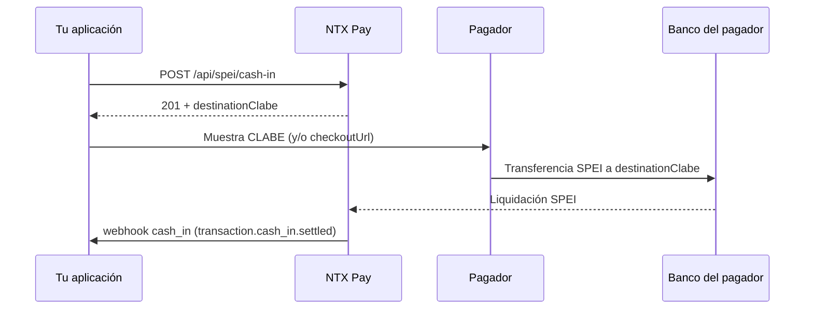

## Visión General

El **cash-in SPEI** genera una **CLABE desechable** que el pagador usa para hacer una transferencia SPEI desde la app de su banco. Cuando NTX Pay recibe la liquidación, se te notifica en el webhook `cash_in` con el evento `transaction.cash_in.settled`.

Características:

- CLABE válida para una **única** transferencia (un solo uso)
- Confirmación **asíncrona** (segundos a minutos)
- Expira en ~24 horas si no se paga (recibes el webhook `transaction.cash_in.expired`)

## Endpoint

### POST /api/spei/cash-in

#### Headers

```
Authorization: Bearer {token}
Content-Type: application/json
```

#### Request

```bash
curl -X POST https://sandbox.mx.ntxpay.com/api/spei/cash-in \
  -H "Authorization: Bearer $TOKEN" \
  -H "Content-Type: application/json" \
  -d '{
    "amountCentavos": 50000,
    "externalId": "order-abc-123",
    "description": "Order #123",
    "customerName": "Juan Perez",
    "customerEmail": "juan@example.com",
    "customerTaxId": "PEPJ800101ABC"
  }'
```

#### Response (201)

```json
{
  "id": 12345,
  "status": "PENDING",
  "destinationClabe": "012180001234567890",
  "beneficiary": {
    "name": "NTX Pay MX",
    "taxId": "NTX800101ABC"
  },
  "referenceNumerical": "1234567",
  "checkoutUrl": "https://pay.ntxpay.com/checkout/xyz",
  "expiresAt": "2026-05-14T23:59:59.000Z",
  "amountCentavos": 50000
}
```

Muestra la `destinationClabe` (y/o la `checkoutUrl`) al pagador final.

## Campos del Request

<ParamField path="amountCentavos" type="integer" required>
  Monto en centavos MXN (mínimo 1). Ej.: `50000` = $500.00 MXN.
</ParamField>

<ParamField path="externalId" type="string">
  Identificador externo único (hasta 100 caracteres). Úsalo para correlacionar con tu sistema. Recomendado para idempotencia.
</ParamField>

<ParamField path="description" type="string">
  Descripción del cobro (hasta 255 caracteres).
</ParamField>

<ParamField path="customerName" type="string" required>
  Nombre del pagador (1–255 caracteres), mostrado en el checkout SPEI.
</ParamField>

<ParamField path="customerEmail" type="string" required>
  Correo electrónico del pagador (formato de e-mail válido).
</ParamField>

<ParamField path="customerTaxId" type="string">
  RFC/CURP del pagador (10–20 caracteres).
</ParamField>

## Flujo de Pago



## Estados de la Transacción

| Status | Significado |
|---|---|
| `PENDING` | CLABE emitida, en espera de la transferencia |
| `CONFIRMED` | Transferencia recibida y liquidada |
| `FAILED` | Error de procesamiento |
| `EXPIRED` | La CLABE expiró sin recibir la transferencia |

En el webhook, la liquidación llega como `transaction.cash_in.settled` con `status: LIQUIDATED` — consulta el [payload completo](/es/guides/webhooks/cash-in).

## Idempotencia

Reenvía la misma solicitud con el mismo `externalId` para garantizar que una falla de red no genere dos cobros. En caso de duplicación, NTX Pay devuelve el cobro existente.

## Probar en el Sandbox

En el sandbox, la liquidación se simula en segundos — sin depender de un banco emisor. Controla el desenlace con el header `X-Sandbox-Scenario`:

```bash
curl -X POST https://sandbox.mx.ntxpay.com/api/spei/cash-in \
  -H "Authorization: Bearer $TOKEN" \
  -H "X-Sandbox-Scenario: rejected" \
  ...
```

Consulta el [catálogo de escenarios](/es/sandbox/scenarios) para forzar rechazo, devolución y retraso.

## Próximos Pasos

<CardGroup cols={2}>
  <Card title="Webhook cash_in" href="/es/guides/webhooks/cash-in">
    Payload del webhook de confirmación
  </Card>
  <Card title="SPEI Cash-Out" href="/es/guides/spei-cash-out">
    Envía transferencias SPEI
  </Card>
</CardGroup>
