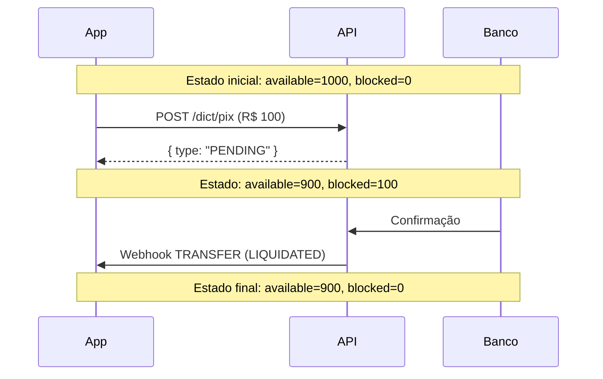
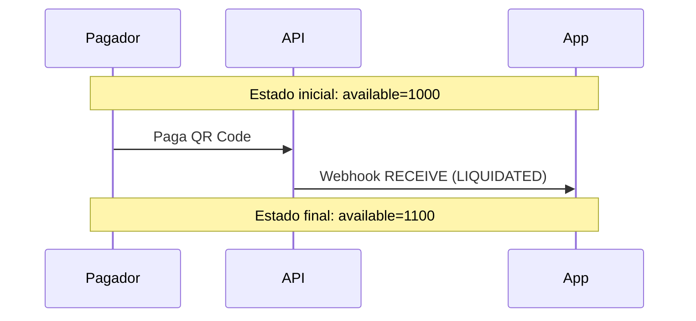

## Visão Geral

O endpoint `GET /accounts/balances` retorna o saldo da conta autenticada no formato compatível com a especificação do Banco Central.

## Endpoint

```
GET /accounts/balances
```

## Autenticação

<ParamField header="Authorization" type="string" required>
  Token Bearer obtido via `/oauth/token`.
</ParamField>

## Request

<CodeGroup>
```bash cURL
curl -X GET https://api.avista.global/accounts/balances \
  -H "Authorization: Bearer <token>"
```

```typescript Node.js
const response = await fetch('https://api.avista.global/accounts/balances', {
  method: 'GET',
  headers: {
    'Authorization': `Bearer ${token}`,
  },
});

const balance = await response.json();
```

```python Python
import requests

response = requests.get(
    'https://api.avista.global/accounts/balances',
    headers={
        'Authorization': f'Bearer {token}',
    }
)

balance = response.json()
```
</CodeGroup>

## Response

<Tabs>
  <Tab title="200 OK">
    ```json
    {
      "data": [
        {
          "eventDate": "2025-01-15T10:30:00.000Z",
          "balanceAmount": {
            "available": 48734.90,
            "blocked": 1500.00,
            "overdraft": 0
          }
        }
      ]
    }
    ```
  </Tab>
  <Tab title="401 Unauthorized">
    ```json
    {
      "statusCode": 401,
      "message": "Token não fornecido ou inválido",
      "error": "Unauthorized"
    }
    ```
  </Tab>
</Tabs>

## Campos da Resposta

<ResponseField name="data" type="array">
  Lista de saldos. Atualmente retorna apenas um item.

  <Expandable title="Item">
    <ResponseField name="eventDate" type="string">
      Data e hora da consulta (ISO 8601).
    </ResponseField>

    <ResponseField name="balanceAmount" type="object">
      Valores do saldo.

      <Expandable title="Propriedades">
        <ResponseField name="available" type="number">
          Saldo disponível para uso imediato. Já desconta valores bloqueados.
        </ResponseField>

        <ResponseField name="blocked" type="number">
          Saldo bloqueado. Valores reservados para operações pendentes (ex: PIX Out em processamento).
        </ResponseField>

        <ResponseField name="overdraft" type="number">
          Limite de crédito (cheque especial). Atualmente sempre `0`.
        </ResponseField>
      </Expandable>
    </ResponseField>
  </Expandable>
</ResponseField>

## Tipos de Saldo

| Tipo | Descrição |
|------|-----------|
| **available** | Saldo que pode ser usado imediatamente para transferências |
| **blocked** | Valores reservados para operações em processamento |
| **overdraft** | Limite de crédito adicional (não implementado) |

### Cálculo do Saldo Total

```
saldoTotal = available + blocked
```

O saldo `available` já desconta os valores `blocked`.

## Comparação com API Padrão

| API Padrão (`GET /balance`) | API BACEN (`GET /accounts/balances`) |
|----------------------------|--------------------------------------|
| `grossBalance` | `available + blocked` |
| `blockedBalance` | `blocked` |
| `netBalance` | `available` |
| `consultedAt` | `eventDate` |

### Exemplo de Equivalência

```json
// API Padrão
{
  "grossBalance": 50234.90,
  "blockedBalance": 1500.00,
  "netBalance": 48734.90,
  "consultedAt": "2025-01-15T10:30:00.000Z"
}

// API BACEN (equivalente)
{
  "data": [{
    "eventDate": "2025-01-15T10:30:00.000Z",
    "balanceAmount": {
      "available": 48734.90,   // = netBalance
      "blocked": 1500.00,       // = blockedBalance
      "overdraft": 0
    }
  }]
}
```

## Fluxo de Saldo em Operações

### PIX Out (Transferência)



### PIX In (Recebimento)



## Boas Práticas

<AccordionGroup>
  <Accordion title="Consulte antes de transferir">
    Sempre verifique o saldo disponível antes de iniciar uma transferência para evitar erros de saldo insuficiente.

    ```typescript
    async function transferir(valor: number) {
      const balance = await getBalance();
      const disponivel = balance.data[0].balanceAmount.available;

      if (valor > disponivel) {
        throw new Error(`Saldo insuficiente. Disponível: ${disponivel}`);
      }

      return await createTransfer(valor);
    }
    ```
  </Accordion>

  <Accordion title="Considere valores bloqueados">
    O saldo `blocked` representa operações em andamento. Em caso de falha, esse valor retorna para `available`.
  </Accordion>

  <Accordion title="Cache com TTL curto">
    Se precisar cachear o saldo, use TTL curto (ex: 5-10 segundos) para manter valores atualizados.
  </Accordion>
</AccordionGroup>

## Erros Comuns

| Código | Erro | Solução |
|--------|------|---------|
| 401 | Token não fornecido | Inclua header `Authorization: Bearer <token>` |
| 401 | Token inválido | Verifique se o token está correto |
| 401 | Token expirado | Obtenha novo token via `/oauth/token` |

## Próximos Passos

<CardGroup cols={2}>
  <Card title="Criar Cobrança" icon="qrcode" href="/pix-bacen/endpoints/cob">
    Gere um QR Code para receber PIX
  </Card>
  <Card title="Transferir PIX" icon="arrow-right" href="/pix-bacen/endpoints/dict-pix">
    Envie um PIX para outra conta
  </Card>
</CardGroup>
