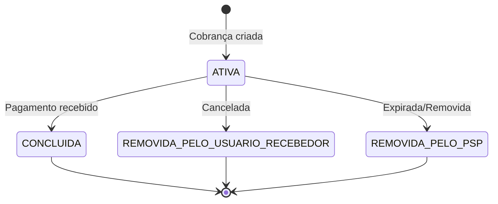

## Visão Geral

O endpoint `PUT /cob/:txid` cria uma cobrança imediata (cob) associada ao identificador de transação (txid) informado. Este endpoint segue a especificação oficial do Banco Central do Brasil para cobranças PIX.

<Info>
  O `txid` é um identificador único gerado pelo seu sistema. Deve ter entre 26 e 35 caracteres alfanuméricos.
</Info>

## Endpoint

```
PUT /cob/{txid}
```

## Autenticação

<ParamField header="Authorization" type="string" required>
  Token Bearer obtido via `/oauth/token`.

  Exemplo: `Bearer eyJhbGciOiJSUzI1NiIs...`
</ParamField>

## Parâmetros de URL

<ParamField path="txid" type="string" required>
  Identificador da transação. Deve ser único e conter entre 26 e 35 caracteres alfanuméricos `[a-zA-Z0-9]`.

  Exemplo: `7978c0c97ea847e78e8849634473c1f1`
</ParamField>

## Request Body

<ParamField body="calendario" type="object" required>
  Informações de controle de tempo da cobrança.

  <Expandable title="Propriedades">
    <ParamField body="expiracao" type="number" default={86400}>
      Tempo de vida da cobrança em segundos. Padrão: 86400 (24 horas).
    </ParamField>
  </Expandable>
</ParamField>

<ParamField body="devedor" type="object">
  Dados do devedor (pagador). Pode ser Pessoa Física (CPF) ou Jurídica (CNPJ).

  <Expandable title="Pessoa Física">
    <ParamField body="cpf" type="string" required>
      CPF do devedor. Apenas números, 11 dígitos.
    </ParamField>
    <ParamField body="nome" type="string" required>
      Nome completo do devedor. Máximo 200 caracteres.
    </ParamField>
  </Expandable>

  <Expandable title="Pessoa Jurídica">
    <ParamField body="cnpj" type="string" required>
      CNPJ do devedor. Apenas números, 14 dígitos.
    </ParamField>
    <ParamField body="nome" type="string" required>
      Razão social do devedor. Máximo 200 caracteres.
    </ParamField>
  </Expandable>
</ParamField>

<ParamField body="valor" type="object" required>
  Valores monetários da cobrança.

  <Expandable title="Propriedades">
    <ParamField body="original" type="string" required>
      Valor original da cobrança. **String** no formato decimal com 2 casas.

      Exemplo: `"123.45"`
    </ParamField>
    <ParamField body="modalidadeAlteracao" type="number" default={0}>
      Modalidade de alteração do valor:
      - `0`: Valor fixo (não pode ser alterado pelo pagador)
      - `1`: Valor alterável (pagador pode modificar)
    </ParamField>
  </Expandable>
</ParamField>

<ParamField body="chave" type="string">
  Chave PIX do recebedor. Pode ser telefone, e-mail, CPF/CNPJ ou EVP (chave aleatória). Máximo 77 caracteres.
</ParamField>

<ParamField body="solicitacaoPagador" type="string">
  Texto livre para o pagador. Máximo 140 caracteres.
</ParamField>

<ParamField body="infoAdicionais" type="array">
  Lista de informações adicionais ao pagador.

  <Expandable title="Item">
    <ParamField body="nome" type="string" required>
      Nome do campo. Máximo 50 caracteres.
    </ParamField>
    <ParamField body="valor" type="string" required>
      Valor do campo. Máximo 200 caracteres.
    </ParamField>
  </Expandable>
</ParamField>

## Request

<CodeGroup>
```bash cURL
curl -X PUT https://api.avista.global/cob/7978c0c97ea847e78e8849634473c1f1 \
  -H "Authorization: Bearer <token>" \
  -H "Content-Type: application/json" \
  -d '{
    "calendario": {
      "expiracao": 3600
    },
    "devedor": {
      "cpf": "12345678909",
      "nome": "Carlos Oliveira"
    },
    "valor": {
      "original": "123.45",
      "modalidadeAlteracao": 0
    },
    "chave": "7d9f0335-8dcc-4054-9bf9-0dbd61d36906",
    "solicitacaoPagador": "Serviço realizado.",
    "infoAdicionais": [
      {
        "nome": "Pedido",
        "valor": "#12345"
      }
    ]
  }'
```

```typescript Node.js
const response = await fetch(
  'https://api.avista.global/cob/7978c0c97ea847e78e8849634473c1f1',
  {
    method: 'PUT',
    headers: {
      'Authorization': `Bearer ${token}`,
      'Content-Type': 'application/json',
    },
    body: JSON.stringify({
      calendario: {
        expiracao: 3600,
      },
      devedor: {
        cpf: '12345678909',
        nome: 'Carlos Oliveira',
      },
      valor: {
        original: '123.45',
        modalidadeAlteracao: 0,
      },
      chave: '7d9f0335-8dcc-4054-9bf9-0dbd61d36906',
      solicitacaoPagador: 'Serviço realizado.',
      infoAdicionais: [
        { nome: 'Pedido', valor: '#12345' },
      ],
    }),
  }
);

const cobranca = await response.json();
```

```python Python
import requests

response = requests.put(
    'https://api.avista.global/cob/7978c0c97ea847e78e8849634473c1f1',
    headers={
        'Authorization': f'Bearer {token}',
        'Content-Type': 'application/json',
    },
    json={
        'calendario': {
            'expiracao': 3600,
        },
        'devedor': {
            'cpf': '12345678909',
            'nome': 'Carlos Oliveira',
        },
        'valor': {
            'original': '123.45',
            'modalidadeAlteracao': 0,
        },
        'chave': '7d9f0335-8dcc-4054-9bf9-0dbd61d36906',
        'solicitacaoPagador': 'Serviço realizado.',
        'infoAdicionais': [
            {'nome': 'Pedido', 'valor': '#12345'},
        ],
    }
)

cobranca = response.json()
```
</CodeGroup>

## Response

<Tabs>
  <Tab title="201 Created">
    ```json
    {
      "calendario": {
        "criacao": "2024-01-15T10:30:00.358Z",
        "expiracao": 3600
      },
      "txid": "7978c0c97ea847e78e8849634473c1f1",
      "revisao": 0,
      "loc": {
        "id": 12345,
        "location": "00020126580014br.gov.bcb.pix0136a629532e-7693-4846-852d-1bbff817b5a8520400005303986540512.345802BR5916Tech Solutions Ltda6009Sao Paulo62070503***6304ABCD",
        "tipoCob": "cob"
      },
      "location": "00020126580014br.gov.bcb.pix0136a629532e-7693-4846-852d-1bbff817b5a8520400005303986540512.345802BR5916Tech Solutions Ltda6009Sao Paulo62070503***6304ABCD",
      "status": "ATIVA",
      "devedor": {
        "cpf": "12345678909",
        "nome": "Carlos Oliveira"
      },
      "valor": {
        "original": "123.45",
        "modalidadeAlteracao": 0
      },
      "chave": "7d9f0335-8dcc-4054-9bf9-0dbd61d36906",
      "solicitacaoPagador": "Serviço realizado.",
      "infoAdicionais": [
        {
          "nome": "Pedido",
          "valor": "#12345"
        }
      ]
    }
    ```
  </Tab>
  <Tab title="400 Bad Request">
    ```json
    {
      "statusCode": 400,
      "message": "CPF deve conter exatamente 11 dígitos numéricos",
      "error": "Bad Request"
    }
    ```
  </Tab>
  <Tab title="409 Conflict">
    ```json
    {
      "statusCode": 409,
      "message": "Cobrança com este txid já existe",
      "error": "Conflict"
    }
    ```
  </Tab>
</Tabs>

## Campos da Resposta

<ResponseField name="calendario" type="object">
  <Expandable title="Propriedades">
    <ResponseField name="criacao" type="string">
      Data e hora de criação da cobrança (ISO 8601).
    </ResponseField>
    <ResponseField name="expiracao" type="number">
      Tempo de expiração em segundos.
    </ResponseField>
  </Expandable>
</ResponseField>

<ResponseField name="txid" type="string">
  Identificador da transação informado na requisição.
</ResponseField>

<ResponseField name="revisao" type="number">
  Número da revisão da cobrança. Sempre `0` na criação.
</ResponseField>

<ResponseField name="loc" type="object">
  Informações do payload PIX.
  <Expandable title="Propriedades">
    <ResponseField name="id" type="number">
      Identificador da transação.
    </ResponseField>
    <ResponseField name="location" type="string">
      Código PIX copia-e-cola (EMV). Use este valor para gerar o QR Code ou permitir que o pagador copie e cole no aplicativo do banco.
    </ResponseField>
    <ResponseField name="tipoCob" type="string">
      Tipo de cobrança. Sempre `"cob"` para cobranças imediatas.
    </ResponseField>
  </Expandable>
</ResponseField>

<ResponseField name="location" type="string">
  Código PIX copia-e-cola (mesmo valor de `loc.location`). String no formato EMV que pode ser usada para pagamento.
</ResponseField>

<ResponseField name="status" type="string">
  Status da cobrança:
  - `ATIVA`: Cobrança ativa, aguardando pagamento
  - `CONCLUIDA`: Pagamento recebido
  - `REMOVIDA_PELO_USUARIO_RECEBEDOR`: Cancelada pelo recebedor
  - `REMOVIDA_PELO_PSP`: Removida pelo PSP
</ResponseField>

## Status da Cobrança



## Webhook de Pagamento

Quando o pagamento for confirmado, você receberá um webhook V2 do tipo `RECEIVE`:

```json
{
  "type": "RECEIVE",
  "data": {
    "id": 123,
    "txId": "7978c0c97ea847e78e8849634473c1f1",
    "status": "LIQUIDATED",
    "payment": {
      "amount": "123.45",
      "currency": "BRL"
    },
    "endToEndId": "E12345678901234567890123456789012",
    "debtorAccount": {
      "name": "Carlos Oliveira",
      "document": "123.xxx.xxx-xx"
    }
  }
}
```

<Card title="Webhooks V2" icon="bell" href="/pix-bacen/webhooks/receive">
  Veja a documentação completa do webhook RECEIVE
</Card>

## Erros Comuns

| Código | Erro | Solução |
|--------|------|---------|
| 400 | txid fora do padrão | Use 26-35 caracteres alfanuméricos |
| 400 | CPF/CNPJ inválido | Verifique formato (apenas números) |
| 400 | Valor inválido | Use formato "123.45" (string com 2 decimais) |
| 401 | Token inválido | Renove o token de acesso |
| 409 | txid já existe | Use um txid diferente |

## Próximos Passos

<CardGroup cols={2}>
  <Card title="Solicitar Devolução" icon="rotate-left" href="/pix-bacen/endpoints/devolucao">
    Devolva um PIX recebido
  </Card>
  <Card title="Webhook RECEIVE" icon="bell" href="/pix-bacen/webhooks/receive">
    Processe notificações de pagamento
  </Card>
</CardGroup>
