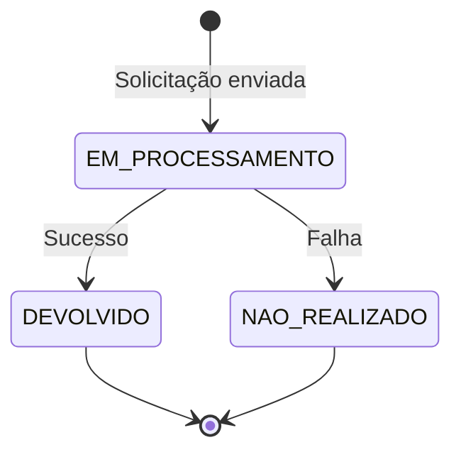

## Visão Geral

O endpoint `PUT /pix/:e2eid/devolucao/:id` solicita a devolução de um PIX recebido. Utiliza o End to End ID (e2eid) da transação original e um identificador de devolução gerado pelo cliente.

<Info>
  A devolução pode ser **total** ou **parcial**. A soma de todas as devoluções não pode ultrapassar o valor original da transação.
</Info>

## Endpoint

```
PUT /pix/{e2eid}/devolucao/{id}
```

## Autenticação

<ParamField header="Authorization" type="string" required>
  Token Bearer obtido via `/oauth/token`.
</ParamField>

## Parâmetros de URL

<ParamField path="e2eid" type="string" required>
  End to End ID - identificador único da transação PIX original. Contém exatamente 32 caracteres alfanuméricos.

  Exemplo: `E12345678901234567890123456789012`
</ParamField>

<ParamField path="id" type="string" required>
  Identificação gerada pelo cliente para representar a devolução. Entre 1 e 35 caracteres.

  Exemplo: `D123456789`
</ParamField>

## Request Body

<ParamField body="valor" type="string" required>
  Valor solicitado para devolução. **String** no formato decimal com 2 casas.

  A soma dos valores de todas as devoluções não pode ultrapassar o valor total do PIX original.

  Exemplo: `"7.89"`
</ParamField>

<ParamField body="natureza" type="string" default="ORIGINAL">
  Indica a natureza da devolução solicitada:

  - `ORIGINAL`: Devolução de PIX comum ou valor da compra em PIX Troco
  - `RETIRADA`: Devolução de PIX Saque ou valor do troco em PIX Troco
</ParamField>

<ParamField body="descricao" type="string">
  Texto a ser apresentado ao pagador contendo informações sobre a devolução.

  Máximo: 140 caracteres.
</ParamField>

## Request

<CodeGroup>
```bash cURL
curl -X PUT https://api.avista.global/pix/E12345678901234567890123456789012/devolucao/D123456789 \
  -H "Authorization: Bearer <token>" \
  -H "Content-Type: application/json" \
  -d '{
    "valor": "7.89",
    "natureza": "ORIGINAL",
    "descricao": "Devolução solicitada pelo recebedor"
  }'
```

```typescript Node.js
const e2eid = 'E12345678901234567890123456789012';
const devolucaoId = 'D123456789';

const response = await fetch(
  `https://api.avista.global/pix/${e2eid}/devolucao/${devolucaoId}`,
  {
    method: 'PUT',
    headers: {
      'Authorization': `Bearer ${token}`,
      'Content-Type': 'application/json',
    },
    body: JSON.stringify({
      valor: '7.89',
      natureza: 'ORIGINAL',
      descricao: 'Devolução solicitada pelo recebedor',
    }),
  }
);

const devolucao = await response.json();
```

```python Python
import requests

e2eid = 'E12345678901234567890123456789012'
devolucao_id = 'D123456789'

response = requests.put(
    f'https://api.avista.global/pix/{e2eid}/devolucao/{devolucao_id}',
    headers={
        'Authorization': f'Bearer {token}',
        'Content-Type': 'application/json',
    },
    json={
        'valor': '7.89',
        'natureza': 'ORIGINAL',
        'descricao': 'Devolução solicitada pelo recebedor',
    }
)

devolucao = response.json()
```
</CodeGroup>

## Response

<Tabs>
  <Tab title="201 Created">
    ```json
    {
      "id": "D123456789",
      "rtrId": "D12345678901234567890123456789012",
      "valor": "7.89",
      "natureza": "ORIGINAL",
      "descricao": "Devolução solicitada pelo recebedor",
      "horario": {
        "solicitacao": "2024-01-15T10:30:00.000Z"
      },
      "status": "EM_PROCESSAMENTO"
    }
    ```
  </Tab>
  <Tab title="400 Bad Request">
    ```json
    {
      "statusCode": 400,
      "message": "Valor deve estar no formato decimal com 2 casas (ex: 7.89)",
      "error": "Bad Request"
    }
    ```
  </Tab>
  <Tab title="404 Not Found">
    ```json
    {
      "statusCode": 404,
      "message": "Transação original não encontrada",
      "error": "Not Found"
    }
    ```
  </Tab>
</Tabs>

## Campos da Resposta

<ResponseField name="id" type="string">
  Identificação gerada pelo cliente para representar a devolução (mesmo valor enviado na URL).
</ResponseField>

<ResponseField name="rtrId" type="string">
  Identificador único da transação de devolução. Contém 32 caracteres.
</ResponseField>

<ResponseField name="valor" type="string">
  Valor da devolução no formato string com 2 casas decimais.
</ResponseField>

<ResponseField name="natureza" type="string">
  Natureza da devolução:
  - `ORIGINAL`: Devolução comum
  - `RETIRADA`: Devolução de saque
  - `MED_OPERACIONAL`: Devolução MED por falha operacional
  - `MED_FRAUDE`: Devolução MED por suspeita de fraude
</ResponseField>

<ResponseField name="descricao" type="string">
  Mensagem ao pagador relativa à devolução.
</ResponseField>

<ResponseField name="horario" type="object">
  <Expandable title="Propriedades">
    <ResponseField name="solicitacao" type="string">
      Horário no qual a devolução foi solicitada (ISO 8601).
    </ResponseField>
    <ResponseField name="liquidacao" type="string">
      Horário no qual a devolução foi liquidada (ISO 8601). Preenchido apenas quando `status = DEVOLVIDO`.
    </ResponseField>
  </Expandable>
</ResponseField>

<ResponseField name="status" type="string">
  Status da devolução:
  - `EM_PROCESSAMENTO`: Devolução em processamento
  - `DEVOLVIDO`: Devolução realizada com sucesso
  - `NAO_REALIZADO`: Devolução não realizada (falha)
</ResponseField>

<ResponseField name="motivo" type="string">
  Campo opcional com detalhes sobre o motivo do status atual. Preenchido principalmente em caso de falha.
</ResponseField>

## Status da Devolução



## Webhook de Devolução

Quando a devolução for processada, você receberá um webhook V2 do tipo `REFUND`:

```json
{
  "type": "REFUND",
  "data": {
    "id": 123,
    "txId": "original-txid",
    "status": "REFUNDED",
    "payment": {
      "amount": "100.00",
      "currency": "BRL"
    },
    "refunds": [
      {
        "status": "LIQUIDATED",
        "payment": {
          "amount": 7.89,
          "currency": "BRL"
        },
        "endToEndId": "D12345678901234567890123456789012",
        "eventDate": "2024-01-15T10:30:00.000Z",
        "information": "Devolução solicitada pelo recebedor"
      }
    ],
    "endToEndId": "E12345678901234567890123456789012",
    "creditDebitType": "DEBIT"
  }
}
```

<Card title="Webhooks REFUND" icon="bell" href="/pix-bacen/webhooks/refund">
  Veja a documentação completa do webhook REFUND
</Card>

## Natureza da Devolução

| Natureza | Descrição |
|----------|-----------|
| `ORIGINAL` | Devolução de PIX comum |
| `RETIRADA` | Devolução de PIX Saque ou Troco |
| `MED_OPERACIONAL` | MED por falha operacional |
| `MED_FRAUDE` | MED por suspeita de fraude |

<Info>
  Os valores `MED_OPERACIONAL` e `MED_FRAUDE` são retornados apenas na resposta, não podem ser enviados na requisição. São utilizados em casos específicos de Mecanismo Especial de Devolução (MED).
</Info>

## Prazo para Devolução

<Warning>
  Devoluções podem ser solicitadas em até **89 dias** após o recebimento do PIX original, conforme regulamentação do Banco Central.
</Warning>

## Devoluções Parciais

Você pode solicitar múltiplas devoluções parciais:

```typescript
// Transação original: R$ 100,00

// Primeira devolução: R$ 30,00
await solicitarDevolucao(e2eid, 'DEV001', '30.00');
// Saldo disponível para devolução: R$ 70,00

// Segunda devolução: R$ 50,00
await solicitarDevolucao(e2eid, 'DEV002', '50.00');
// Saldo disponível para devolução: R$ 20,00

// Terceira devolução: R$ 25,00 - ERRO!
await solicitarDevolucao(e2eid, 'DEV003', '25.00');
// Falha: valor excede saldo disponível (R$ 20,00)
```

## Erros Comuns

| Código | Erro | Solução |
|--------|------|---------|
| 400 | Valor inválido | Use formato "7.89" (string com 2 decimais) |
| 400 | Valor excede disponível | Verifique saldo disponível para devolução |
| 404 | Transação não encontrada | Verifique o e2eid informado |
| 404 | Transação não é do tipo recebimento | Devoluções só para PIX recebidos |
| 422 | Prazo expirado | Devoluções só até 89 dias após recebimento |

## Próximos Passos

<CardGroup cols={2}>
  <Card title="Transferência PIX" icon="arrow-right" href="/pix-bacen/endpoints/dict-pix">
    Envie um PIX para outra conta
  </Card>
  <Card title="Webhook REFUND" icon="bell" href="/pix-bacen/webhooks/refund">
    Processe notificações de devolução
  </Card>
</CardGroup>
