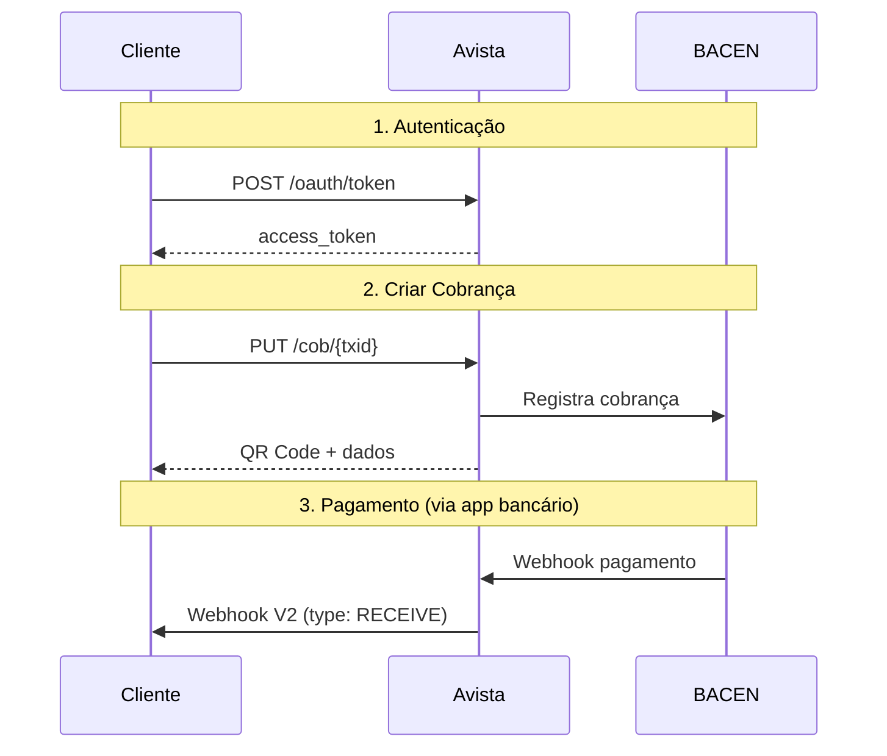

## O que é PIX Bacen?

A **API PIX Bacen** é uma versão da API Avista que segue a especificação oficial do Banco Central do Brasil para o sistema de pagamentos instantâneos PIX. Esta versão foi desenvolvida para atender integradores que precisam de compatibilidade com o formato padrão BACEN.

<Info>
  Esta API é uma alternativa à [API padrão Avista](/api-reference/introduction). Ambas oferecem as mesmas funcionalidades, mas com formatos de requisição e resposta diferentes.
</Info>

## Quando usar a API PIX Bacen?

Use esta API quando:

- Seu sistema já está integrado com outros PSPs que seguem a especificação BACEN
- Você precisa manter compatibilidade com múltiplos provedores PIX
- Sua aplicação foi construída seguindo a documentação oficial do Banco Central
- Você prefere trabalhar com o formato de webhook V2 (envelope `{type, data}`)

## Principais diferenças

<CardGroup cols={2}>
  <Card title="Formato de Valores" icon="dollar-sign">
    Valores monetários são **strings** com 2 casas decimais (ex: `"123.45"`) ao invés de números.
  </Card>
  <Card title="Estrutura de Webhook" icon="bell">
    Webhooks usam formato envelope `{type, data}` com status `LIQUIDATED` ao invés de `CONFIRMED`.
  </Card>
  <Card title="Identificadores" icon="fingerprint">
    Usa `txid` para cobranças e `e2eid` para devoluções, seguindo nomenclatura BACEN.
  </Card>
  <Card title="Campos Separados" icon="users">
    Contraparte dividida em `debtorAccount` (pagador) e `creditorAccount` (recebedor).
  </Card>
</CardGroup>

## Endpoints disponíveis

| Endpoint | Método | Descrição |
|----------|--------|-----------|
| `/cob/:txid` | PUT | Criar cobrança imediata (QR Code PIX) |
| `/pix/:e2eid/devolucao/:id` | PUT | Solicitar devolução de um PIX recebido |
| `/dict/pix` | POST | Iniciar transferência PIX (Cash-Out) |
| `/accounts/balances` | GET | Consultar saldo da conta |

## Comparação com API padrão

| Operação | API Padrão | API PIX Bacen |
|----------|------------|---------------|
| Cash-In | `POST /pix/cash-in` | `PUT /cob/:txid` |
| Cash-Out | `POST /pix/cash-out` | `POST /dict/pix` |
| Refund | `POST /pix/:id/refund` | `PUT /pix/:e2eid/devolucao/:id` |
| Balance | `GET /balance` | `GET /accounts/balances` |

## Fluxo de integração

## Próximos passos

<CardGroup cols={2}>
  <Card title="Autenticação" icon="key" href="/pix-bacen/authentication">
    Configure a autenticação para acessar a API
  </Card>
  <Card title="Ativação" icon="toggle-on" href="/pix-bacen/activation">
    Saiba como ativar o modo PIX Bacen na sua conta
  </Card>
  <Card title="Criar Cobrança" icon="qrcode" href="/pix-bacen/endpoints/cob">
    Gere sua primeira cobrança PIX
  </Card>
  <Card title="Webhooks V2" icon="bell" href="/pix-bacen/webhooks/overview">
    Entenda o formato de notificações V2
  </Card>
</CardGroup>
