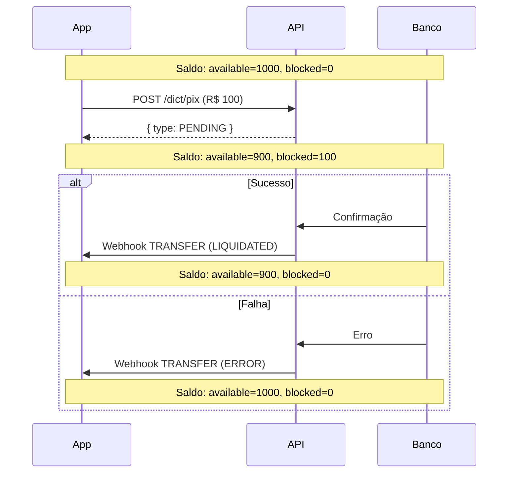

## Visão Geral

O webhook `TRANSFER` é enviado quando uma transferência PIX iniciada pela sua aplicação é processada. Este evento indica o resultado (sucesso ou falha) de uma chamada ao endpoint `/dict/pix`.

## Quando é enviado

- Transferência PIX processada com sucesso (`LIQUIDATED`)
- Transferência PIX falhou (`ERROR`)

## Estrutura do Payload

```json
{
  "type": "TRANSFER",
  "data": {
    "id": 456,
    "txId": null,
    "pixKey": "destino@email.com",
    "status": "LIQUIDATED",
    "payment": {
      "amount": "100.50",
      "currency": "BRL"
    },
    "refunds": [],
    "createdAt": "2024-01-15T10:30:00.000Z",
    "errorCode": null,
    "endToEndId": "E12345678901234567890123456789012",
    "ticketData": {},
    "webhookType": "TRANSFER",
    "debtorAccount": {
      "ispb": null,
      "name": null,
      "issuer": null,
      "number": null,
      "document": null,
      "accountType": null
    },
    "idempotencyKey": "550e8400-e29b-41d4-a716-446655440000",
    "creditDebitType": "DEBIT",
    "creditorAccount": {
      "ispb": "18236120",
      "name": "NU PAGAMENTOS S.A.",
      "issuer": "260",
      "number": "12345-6",
      "document": "123.xxx.xxx-xx",
      "accountType": null
    },
    "localInstrument": "DICT",
    "transactionType": "PIX",
    "remittanceInformation": "Pagamento NF 12345"
  }
}
```

## Campos Importantes

<ResponseField name="type" type="string">
  Sempre `"TRANSFER"` para PIX enviado.
</ResponseField>

<ResponseField name="data.id" type="number">
  ID da transação. Mesmo valor retornado no `POST /dict/pix`.
</ResponseField>

<ResponseField name="data.endToEndId" type="string">
  End to End ID - identificador único da transação PIX no Banco Central.
</ResponseField>

<ResponseField name="data.status" type="string">
  Status da transferência:
  - `LIQUIDATED`: Transferência confirmada (sucesso)
  - `ERROR`: Falha na transferência
</ResponseField>

<ResponseField name="data.payment" type="object">
  <Expandable title="Propriedades">
    <ResponseField name="amount" type="string">
      Valor transferido. **String** com 2 casas decimais.
    </ResponseField>
    <ResponseField name="currency" type="string">
      Moeda. Sempre `"BRL"`.
    </ResponseField>
  </Expandable>
</ResponseField>

<ResponseField name="data.idempotencyKey" type="string">
  Chave de idempotência enviada no header `x-idempotency-key` da requisição original.
</ResponseField>

<ResponseField name="data.creditorAccount" type="object">
  Dados de quem recebeu (o destinatário).

  <Expandable title="Propriedades">
    <ResponseField name="ispb" type="string">
      Código ISPB do banco do destinatário.
    </ResponseField>
    <ResponseField name="name" type="string">
      Nome do banco do destinatário.
    </ResponseField>
    <ResponseField name="issuer" type="string">
      Código do banco (ex: "260" para Nubank).
    </ResponseField>
    <ResponseField name="number" type="string">
      Número da conta do destinatário.
    </ResponseField>
    <ResponseField name="document" type="string">
      CPF/CNPJ do destinatário (mascarado).
    </ResponseField>
  </Expandable>
</ResponseField>

<ResponseField name="data.creditDebitType" type="string">
  Sempre `"DEBIT"` para transferências enviadas.
</ResponseField>

<ResponseField name="data.errorCode" type="string">
  Código de erro quando `status === 'ERROR'`. Pode ser `null` em caso de sucesso.
</ResponseField>

<ResponseField name="data.remittanceInformation" type="string">
  Descrição da transferência (campo `description` enviado na requisição).
</ResponseField>

## Processando o Webhook

### Exemplo Node.js

```typescript
interface TransferWebhook {
  type: 'TRANSFER';
  data: {
    id: number;
    status: 'LIQUIDATED' | 'ERROR';
    payment: {
      amount: string;
      currency: string;
    };
    endToEndId: string;
    idempotencyKey: string;
    creditorAccount: {
      name: string | null;
      document: string | null;
    };
    errorCode: string | null;
  };
}

async function handleTransfer(webhook: TransferWebhook) {
  const { data } = webhook;

  // Encontrar transferência pelo idempotencyKey
  const transfer = await findTransferByIdempotencyKey(data.idempotencyKey);

  if (!transfer) {
    console.warn(`Transferência não encontrada: ${data.idempotencyKey}`);
    return;
  }

  if (data.status === 'LIQUIDATED') {
    // Sucesso - confirmar transferência
    await updateTransfer(transfer.id, {
      status: 'COMPLETED',
      endToEndId: data.endToEndId,
      completedAt: new Date(),
    });

    // Notificar usuário
    await notifyTransferSuccess({
      transferId: transfer.id,
      amount: parseFloat(data.payment.amount),
      recipient: data.creditorAccount.name,
    });

  } else if (data.status === 'ERROR') {
    // Falha - reverter
    await updateTransfer(transfer.id, {
      status: 'FAILED',
      errorCode: data.errorCode,
    });

    // Notificar usuário
    await notifyTransferFailed({
      transferId: transfer.id,
      errorCode: data.errorCode,
    });

    // Liberar saldo bloqueado
    await releaseBlockedBalance(transfer.id);
  }
}
```

### Exemplo Python

```python
from decimal import Decimal

def handle_transfer(webhook: dict):
    data = webhook['data']

    # Encontrar transferência
    transfer = find_transfer_by_idempotency_key(data['idempotencyKey'])

    if not transfer:
        print(f"Transferência não encontrada: {data['idempotencyKey']}")
        return

    if data['status'] == 'LIQUIDATED':
        # Sucesso
        update_transfer(
            transfer_id=transfer.id,
            status='COMPLETED',
            e2e_id=data['endToEndId']
        )

        notify_transfer_success(
            transfer_id=transfer.id,
            amount=Decimal(data['payment']['amount']),
            recipient=data['creditorAccount'].get('name')
        )

    elif data['status'] == 'ERROR':
        # Falha
        update_transfer(
            transfer_id=transfer.id,
            status='FAILED',
            error_code=data['errorCode']
        )

        notify_transfer_failed(
            transfer_id=transfer.id,
            error_code=data['errorCode']
        )

        # Liberar saldo
        release_blocked_balance(transfer.id)
```

## Correlação com Requisição

Use `idempotencyKey` para correlacionar o webhook com sua requisição original:

```typescript
// 1. Criar transferência
const idempotencyKey = crypto.randomUUID();
const transfer = await createTransfer(idempotencyKey, {
  pixKey: 'destino@email.com',
  amount: 100.50,
});

// 2. Salvar associação
await saveTransfer({
  id: transfer.id,
  idempotencyKey,
  status: 'PENDING',
});

// 3. No webhook TRANSFER
const savedTransfer = await findByIdempotencyKey(webhook.data.idempotencyKey);
// savedTransfer.id corresponde à transferência original
```

## Tratamento de Erros

Códigos de erro comuns:

| Código | Descrição | Ação Recomendada |
|--------|-----------|------------------|
| `INSUFFICIENT_BALANCE` | Saldo insuficiente | Verificar saldo antes de transferir |
| `INVALID_KEY` | Chave PIX inválida | Verificar chave com usuário |
| `KEY_NOT_FOUND` | Chave não encontrada no DICT | Solicitar chave válida |
| `ACCOUNT_BLOCKED` | Conta bloqueada | Contatar suporte |
| `TIMEOUT` | Timeout no processamento | Tentar novamente |

```typescript
if (data.status === 'ERROR') {
  switch (data.errorCode) {
    case 'INSUFFICIENT_BALANCE':
      // Notificar saldo insuficiente
      await notifyInsufficientBalance(transfer);
      break;

    case 'INVALID_KEY':
    case 'KEY_NOT_FOUND':
      // Solicitar nova chave ao usuário
      await requestNewPixKey(transfer);
      break;

    case 'TIMEOUT':
      // Pode tentar novamente com nova idempotency key
      await retryTransfer(transfer);
      break;

    default:
      // Erro genérico
      await notifyGenericError(transfer, data.errorCode);
  }
}
```

## Fluxo de Saldo



## Idempotência

Use `data.id` para evitar processamento duplicado:

```typescript
async function handleWebhook(webhook: TransferWebhook) {
  const webhookId = `transfer:${webhook.data.id}`;

  const isProcessed = await redis.sismember('processed', webhookId);
  if (isProcessed) {
    return; // Já processado
  }

  await redis.sadd('processed', webhookId);
  await handleTransfer(webhook);
}
```

## Boas Práticas

<AccordionGroup>
  <Accordion title="Sempre salve o idempotencyKey">
    Salve o `idempotencyKey` junto com a transferência para facilitar a correlação no webhook.
  </Accordion>

  <Accordion title="Trate todos os status">
    Implemente tratamento tanto para `LIQUIDATED` quanto para `ERROR`.
  </Accordion>

  <Accordion title="Libere saldo em caso de erro">
    Se a transferência falhar, o saldo bloqueado deve ser liberado. Certifique-se de atualizar seu sistema.
  </Accordion>

  <Accordion title="Notifique o usuário">
    Informe o usuário sobre o resultado da transferência, especialmente em caso de falha.
  </Accordion>
</AccordionGroup>

## Próximos Passos

<CardGroup cols={2}>
  <Card title="RECEIVE" icon="arrow-down" href="/pix-bacen/webhooks/receive">
    PIX recebido
  </Card>
  <Card title="REFUND" icon="rotate-left" href="/pix-bacen/webhooks/refund">
    Devolução
  </Card>
</CardGroup>
