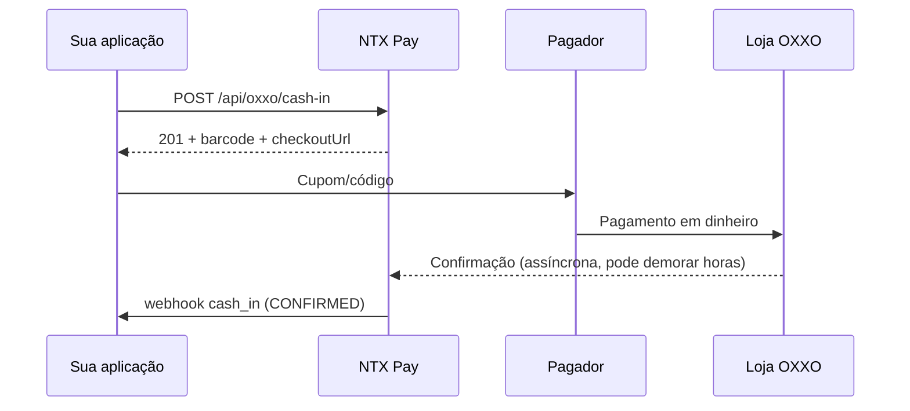

## Visão Geral

O **OXXO cash-in** gera um **código de barras / cupom** que o pagador imprime ou exibe no celular e leva a qualquer loja da rede **OXXO** no México para pagar em dinheiro. Após a leitura no caixa, o NTX Pay recebe a confirmação e dispara o webhook `cash_in`.

Características:

- Pagamento **off-line** (loja física OXXO)
- Confirmação **tardia** — pode levar de minutos a algumas horas após o pagamento
- Expira em data configurável (default ~7 dias)

## Endpoint

### POST /api/oxxo/cash-in

#### Headers

```
Authorization: Bearer {token}
Content-Type: application/json
```

#### Request

```bash
curl -X POST https://sandbox.ntxpay.com/api/oxxo/cash-in \
  -H "Authorization: Bearer $TOKEN" \
  -H "Content-Type: application/json" \
  -d '{
    "amountCentavos": 20000,
    "customerName": "Juan Perez",
    "customerTaxId": "PEPJ800101ABC",
    "externalId": "order-xyz-789"
  }'
```

#### Response (201)

```json
{
  "id": 33333,
  "status": "PENDING",
  "barcode": "012345678901234567",
  "referenceNumerical": "12345-67890",
  "checkoutUrl": "https://pay.ntxpay.com/oxxo/abc",
  "expiresAt": "2026-05-20T23:59:59.000Z",
  "amountCentavos": 20000
}
```

## Campos do Request

<ParamField path="amountCentavos" type="integer" required>
  Valor em centavos MXN (mínimo 1). Ex.: `20000` = $200.00 MXN.
</ParamField>

<ParamField path="customerName" type="string" required>
  Nome do pagador (3–255 caracteres). Aparece no cupom.
</ParamField>

<ParamField path="customerTaxId" type="string">
  RFC/CURP do pagador (10–20 caracteres).
</ParamField>

<ParamField path="externalId" type="string">
  Identificador externo (até 100 caracteres). Recomendado para idempotência.
</ParamField>

## O que mostrar ao pagador

A resposta traz três representações da mesma cobrança:

- **`barcode`** — código de barras em string. Gere a imagem usando uma lib local (`bwip-js`, `python-barcode`, etc.).
- **`referenceNumerical`** — número de referência humano-legível para digitação no caixa.
- **`checkoutUrl`** — URL pública pronta com cupom imprimível.

Recomendação: exiba o `checkoutUrl` (visual já pronto) ou gere a imagem do `barcode` no seu app.

## Fluxo



## Estados

| Status | Significado |
|---|---|
| `PENDING` | Cobrança emitida, aguardando pagamento na OXXO |
| `CONFIRMED` | Pagamento recebido e confirmado |
| `EXPIRED` | Cobrança expirou sem ser paga |

## Considerações

<Warning>
  A confirmação OXXO **não é em tempo real**. Não exiba o produto como "pago" antes do webhook `cash_in`. Para experiências que exigem confirmação imediata, prefira SPEI cash-in.
</Warning>

- O `barcode` é único por cobrança e não pode ser reutilizado
- O OXXO tem limite máximo de ~$10 000 MXN por transação (varia por loja)
- Não é possível pagar parcial — o pagador paga o valor exato do cupom

## Próximos Passos

<CardGroup cols={2}>
  <Card title="Webhook cash_in" href="/api-reference/guides/webhooks/cash-in">
    Receba confirmação assíncrona do pagamento
  </Card>
  <Card title="SPEI Cash-In" href="/api-reference/guides/spei-cash-in">
    Para confirmação imediata, use SPEI
  </Card>
</CardGroup>
