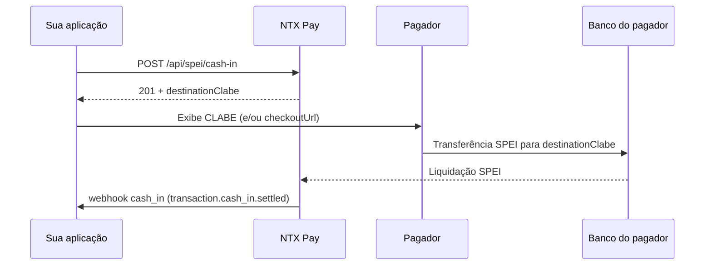

## Visão Geral

O **cash-in SPEI** gera uma **CLABE descartável** que o pagador usa para fazer uma transferência SPEI pelo app do banco. Quando a NTX Pay recebe a liquidação, você é notificado no webhook `cash_in` com o evento `transaction.cash_in.settled`.

Características:

- CLABE válida para uma **única** transferência (uso único)
- Confirmação **assíncrona** (segundos a minutos)
- Expira em data configurável (padrão ~24 horas)

## Endpoint

### POST /api/spei/cash-in

#### Headers

```
Authorization: Bearer {token}
Content-Type: application/json
```

#### Request

```bash
curl -X POST https://sandbox.mx.ntxpay.com/api/spei/cash-in \
  -H "Authorization: Bearer $TOKEN" \
  -H "Content-Type: application/json" \
  -d '{
    "amountCentavos": 50000,
    "externalId": "order-abc-123",
    "description": "Order #123",
    "customerName": "Juan Perez",
    "customerEmail": "juan@example.com",
    "customerTaxId": "PEPJ800101ABC"
  }'
```

#### Response (201)

```json
{
  "id": 12345,
  "status": "PENDING",
  "destinationClabe": "012180001234567890",
  "beneficiary": {
    "name": "NTX Pay MX",
    "taxId": "NTX800101ABC"
  },
  "referenceNumerical": "1234567",
  "checkoutUrl": "https://pay.ntxpay.com/checkout/xyz",
  "expiresAt": "2026-05-14T23:59:59.000Z",
  "amountCentavos": 50000
}
```

Exiba a `destinationClabe` (e/ou a `checkoutUrl`) ao pagador final.

## Campos do Request

<ParamField path="amountCentavos" type="integer" required>
  Valor em centavos MXN (mínimo 1). Ex.: `50000` = $500,00 MXN.
</ParamField>

<ParamField path="externalId" type="string">
  Identificador externo único (até 100 caracteres). Use para correlacionar com o seu sistema. Recomendado para idempotência.
</ParamField>

<ParamField path="description" type="string">
  Descrição da cobrança (até 255 caracteres).
</ParamField>

<ParamField path="customerName" type="string" required>
  Nome do pagador (1–255 caracteres), exibido no checkout SPEI.
</ParamField>

<ParamField path="customerEmail" type="string" required>
  E-mail do pagador (formato de e-mail válido).
</ParamField>

<ParamField path="customerTaxId" type="string">
  RFC/CURP do pagador (10–20 caracteres).
</ParamField>

## Fluxo de Pagamento



## Estados da Transação

| Status | Significado |
|---|---|
| `PENDING` | CLABE emitida, aguardando transferência |
| `CONFIRMED` | Transferência recebida e liquidada |
| `FAILED` | Erro de processamento |
| `EXPIRED` | CLABE expirou sem receber transferência |

No webhook, a liquidação chega como `transaction.cash_in.settled` com `status: LIQUIDATED` — veja o [payload completo](/pt-br/guides/webhooks/cash-in).

## Idempotência

Reenvie a mesma requisição com o mesmo `externalId` para garantir que uma falha de rede não gere duas cobranças. Em caso de duplicação, a NTX Pay retorna a cobrança existente.

## Testar no Sandbox

No sandbox, a liquidação é simulada em segundos — sem depender de um banco emissor. Controle o desfecho com o header `X-Sandbox-Scenario`:

```bash
curl -X POST https://sandbox.mx.ntxpay.com/api/spei/cash-in \
  -H "Authorization: Bearer $TOKEN" \
  -H "X-Sandbox-Scenario: rejected" \
  ...
```

Veja o [catálogo de cenários](/pt-br/sandbox/scenarios) para forçar rejeição, devolução e atraso.

## Próximos Passos

<CardGroup cols={2}>
  <Card title="Webhook cash_in" href="/pt-br/guides/webhooks/cash-in">
    Payload do webhook de confirmação
  </Card>
  <Card title="SPEI Cash-Out" href="/pt-br/guides/spei-cash-out">
    Envie transferências SPEI
  </Card>
</CardGroup>
